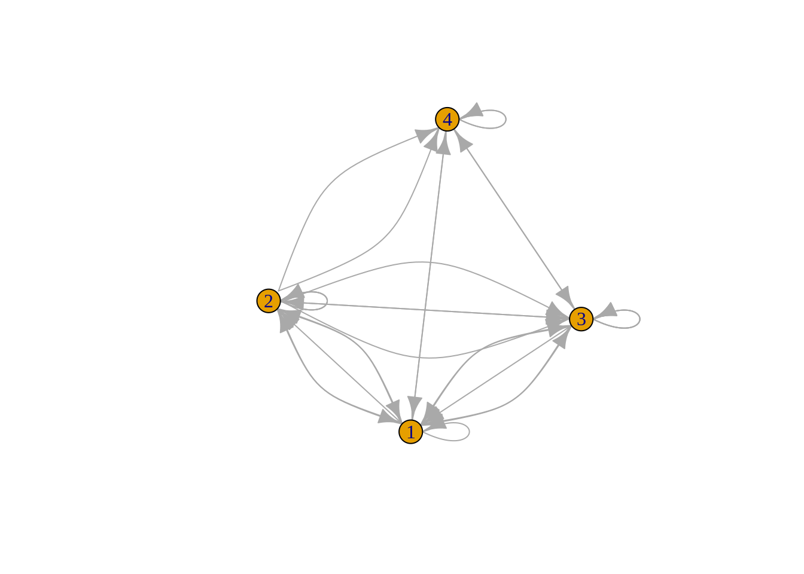

# Interactive plot introduction

Yujie Zhou


```r
library(ggplot2)
library(plotly)
library(gapminder)
library("tidyr")
library("heatmaply")
library(igraph)
library(networkD3)
```
Interactive plots are used widely in today's data analysis.This tutorial will introduce four commonly used interactive plots: interactive bubble plot, interactive area plot, interactive heatmap, and interactive network. Unlike static plot, interactive plot can enable users to zoom in and out and give user a better use experience and simplify analysis process. 


## Interactive Bubble Plot:

A bubble plot is where a third dimension is added on a scatterplot. The size of each bubble represent the additional numeric variable.

We can draw the plot directly using "plotly" just right after we draw a bubble plot using "ggplot". The following is an example to see how the number and lifespan of people in different nations are associated.


```r
knitr::opts_chunk$set(warning = F, message = F)

head(gapminder)
```

```
## # A tibble: 6 × 6
##   country     continent  year lifeExp      pop gdpPercap
##   <fct>       <fct>     <int>   <dbl>    <int>     <dbl>
## 1 Afghanistan Asia       1952    28.8  8425333      779.
## 2 Afghanistan Asia       1957    30.3  9240934      821.
## 3 Afghanistan Asia       1962    32.0 10267083      853.
## 4 Afghanistan Asia       1967    34.0 11537966      836.
## 5 Afghanistan Asia       1972    36.1 13079460      740.
## 6 Afghanistan Asia       1977    38.4 14880372      786.
```

```r
p <- gapminder %>%
  filter(year==1967) %>%
  ggplot( aes(x=gdpPercap, y=lifeExp, size=pop,color=continent)) +
  geom_point() +
  scale_x_log10() +
  theme_bw()

ggplotly(p)
```

```{=html}
<div id="htmlwidget-553d8a09119a34b45b1f" style="width:672px;height:480px;" class="plotly html-widget"></div>
<script type="application/json" data-for="htmlwidget-553d8a09119a34b45b1f">{"x":{"data":[{"x":[3.51148118797499,3.74215745838396,3.01528907661539,3.08447235438054,2.90027237094209,2.61592640520288,3.1785318256936,3.055399974834,3.078025414328,3.27323969635094,2.93530228406906,3.4278007842362,3.31218803864046,3.48001420697493,3.25884808894596,2.96170388787321,2.67098294312012,2.71274954741178,3.9221419590145,2.866159048101,3.05142157041711,2.8504989181547,2.85465858235922,3.02396669067389,2.69778626600553,2.8534570617051,4.27352793571109,3.2132646189128,2.69505661348785,2.73640438110395,3.15263845040986,3.39364320442555,3.23326137313525,2.7533295728751,3.57906238390086,3.02299917399278,3.00625808906951,3.60435305365754,2.70839006005204,3.14139978526705,3.20747403709274,3.08136295976889,3.10881294051872,3.85214303897666,3.22737183535753,3.41715630666173,2.92850782101237,3.16955593013409,3.28608807651144,2.95852495345071,3.24970632372554,2.75571868821708],"y":[51.407,35.985,44.885,53.298,40.697,43.548,44.799,41.478,43.601,46.472,44.056,52.04,47.35,42.074,49.293,38.987,42.189,42.115,44.598,35.857,48.072,37.197,35.492,50.654,48.492,41.536,50.227,42.881,39.487,38.487,46.289,61.557,50.335,38.113,51.159,40.118,41.04,60.542,44.1,54.425,43.563,34.113,38.977,51.927,42.858,46.633,45.757,46.769,52.053,48.051,47.768,53.995],"text":["gdpPercap:  3246.9918<br />lifeExp: 51.40700<br />pop:  12760499<br />continent: Africa","gdpPercap:  5522.7764<br />lifeExp: 35.98500<br />pop:   5247469<br />continent: Africa","gdpPercap:  1035.8314<br />lifeExp: 44.88500<br />pop:   2427334<br />continent: Africa","gdpPercap:  1214.7093<br />lifeExp: 53.29800<br />pop:    553541<br />continent: Africa","gdpPercap:   794.8266<br />lifeExp: 40.69700<br />pop:   5127935<br />continent: Africa","gdpPercap:   412.9775<br />lifeExp: 43.54800<br />pop:   3330989<br />continent: Africa","gdpPercap:  1508.4531<br />lifeExp: 44.79900<br />pop:   6335506<br />continent: Africa","gdpPercap:  1136.0566<br />lifeExp: 41.47800<br />pop:   1733638<br />continent: Africa","gdpPercap:  1196.8106<br />lifeExp: 43.60100<br />pop:   3495967<br />continent: Africa","gdpPercap:  1876.0296<br />lifeExp: 46.47200<br />pop:    217378<br />continent: Africa","gdpPercap:   861.5932<br />lifeExp: 44.05600<br />pop:  19941073<br />continent: Africa","gdpPercap:  2677.9396<br />lifeExp: 52.04000<br />pop:   1179760<br />continent: Africa","gdpPercap:  2052.0505<br />lifeExp: 47.35000<br />pop:   4744870<br />continent: Africa","gdpPercap:  3020.0505<br />lifeExp: 42.07400<br />pop:    127617<br />continent: Africa","gdpPercap:  1814.8807<br />lifeExp: 49.29300<br />pop:  31681188<br />continent: Africa","gdpPercap:   915.5960<br />lifeExp: 38.98700<br />pop:    259864<br />continent: Africa","gdpPercap:   468.7950<br />lifeExp: 42.18900<br />pop:   1820319<br />continent: Africa","gdpPercap:   516.1186<br />lifeExp: 42.11500<br />pop:  27860297<br />continent: Africa","gdpPercap:  8358.7620<br />lifeExp: 44.59800<br />pop:    489004<br />continent: Africa","gdpPercap:   734.7829<br />lifeExp: 35.85700<br />pop:    439593<br />continent: Africa","gdpPercap:  1125.6972<br />lifeExp: 48.07200<br />pop:   8490213<br />continent: Africa","gdpPercap:   708.7595<br />lifeExp: 37.19700<br />pop:   3451418<br />continent: Africa","gdpPercap:   715.5806<br />lifeExp: 35.49200<br />pop:    601287<br />continent: Africa","gdpPercap:  1056.7365<br />lifeExp: 50.65400<br />pop:  10191512<br />continent: Africa","gdpPercap:   498.6390<br />lifeExp: 48.49200<br />pop:    996380<br />continent: Africa","gdpPercap:   713.6036<br />lifeExp: 41.53600<br />pop:   1279406<br />continent: Africa","gdpPercap: 18772.7517<br />lifeExp: 50.22700<br />pop:   1759224<br />continent: Africa","gdpPercap:  1634.0473<br />lifeExp: 42.88100<br />pop:   6334556<br />continent: Africa","gdpPercap:   495.5148<br />lifeExp: 39.48700<br />pop:   4147252<br />continent: Africa","gdpPercap:   545.0099<br />lifeExp: 38.48700<br />pop:   5212416<br />continent: Africa","gdpPercap:  1421.1452<br />lifeExp: 46.28900<br />pop:   1230542<br />continent: Africa","gdpPercap:  2475.3876<br />lifeExp: 61.55700<br />pop:    789309<br />continent: Africa","gdpPercap:  1711.0448<br />lifeExp: 50.33500<br />pop:  14770296<br />continent: Africa","gdpPercap:   566.6692<br />lifeExp: 38.11300<br />pop:   8680909<br />continent: Africa","gdpPercap:  3793.6948<br />lifeExp: 51.15900<br />pop:    706640<br />continent: Africa","gdpPercap:  1054.3849<br />lifeExp: 40.11800<br />pop:   4534062<br />continent: Africa","gdpPercap:  1014.5141<br />lifeExp: 41.04000<br />pop:  47287752<br />continent: Africa","gdpPercap:  4021.1757<br />lifeExp: 60.54200<br />pop:    414024<br />continent: Africa","gdpPercap:   510.9637<br />lifeExp: 44.10000<br />pop:   3451079<br />continent: Africa","gdpPercap:  1384.8406<br />lifeExp: 54.42500<br />pop:     70787<br />continent: Africa","gdpPercap:  1612.4046<br />lifeExp: 43.56300<br />pop:   3965841<br />continent: Africa","gdpPercap:  1206.0435<br />lifeExp: 34.11300<br />pop:   2662190<br />continent: Africa","gdpPercap:  1284.7332<br />lifeExp: 38.97700<br />pop:   3428839<br />continent: Africa","gdpPercap:  7114.4780<br />lifeExp: 51.92700<br />pop:  20997321<br />continent: Africa","gdpPercap:  1687.9976<br />lifeExp: 42.85800<br />pop:  12716129<br />continent: Africa","gdpPercap:  2613.1017<br />lifeExp: 46.63300<br />pop:    420690<br />continent: Africa","gdpPercap:   848.2187<br />lifeExp: 45.75700<br />pop:  12607312<br />continent: Africa","gdpPercap:  1477.5968<br />lifeExp: 46.76900<br />pop:   1735550<br />continent: Africa","gdpPercap:  1932.3602<br />lifeExp: 52.05300<br />pop:   4786986<br />continent: Africa","gdpPercap:   908.9185<br />lifeExp: 48.05100<br />pop:   8900294<br />continent: Africa","gdpPercap:  1777.0773<br />lifeExp: 47.76800<br />pop:   3900000<br />continent: Africa","gdpPercap:   569.7951<br />lifeExp: 53.99500<br />pop:   4995432<br />continent: Africa"],"type":"scatter","mode":"markers","marker":{"autocolorscale":false,"color":"rgba(248,118,109,1)","opacity":1,"size":[6.23033823882774,5.34487095391705,4.83566863638713,4.25754838925716,5.32669284741034,5.02176935170475,5.50153363393661,4.66670512098506,5.05281243648271,4.04294075954683,6.8463309896338,4.50403753146021,5.26694233482354,3.94353845814101,7.64763816502546,4.07868735808798,4.68953475498293,7.40633356213938,4.22445042139745,4.19734144568154,5.77582441801779,5.04450495796064,4.28063006599633,5.96824497427764,4.44142989243661,4.53588762313805,4.67350448930909,5.50140306401048,5.16860270346336,5.33956222687268,4.52044020619855,4.36270929777781,6.41728766483351,5.7983054225943,4.32813569461946,5.2330130619791,8.50704255825511,4.18259798106924,5.04444153221422,3.77952755905512,5.13734262393393,4.88704700395513,5.0402735326146,6.92678691335833,6.22604981637089,4.18649317184353,6.21550053969125,4.66721502721481,5.27362851037454,5.82386277045545,5.12581763259667,5.30628957247822],"symbol":"circle","line":{"width":1.88976377952756,"color":"rgba(248,118,109,1)"}},"hoveron":"points","name":"Africa","legendgroup":"Africa","showlegend":true,"xaxis":"x","yaxis":"y","hoverinfo":"text","frame":null},{"x":[3.90595516552978,3.41277729936084,3.53527694506573,4.206193882909,3.70813645996287,3.42792891541937,3.61927367509308,3.75513272240462,3.21846276740337,3.6607776823798,3.63934655547257,3.51088415650793,3.16198386397309,3.40453770699663,3.78708506565499,3.76002524528695,3.66683549228173,3.64552140726666,3.36161005279027,3.76253552527651,3.84068796748737,3.74984205355686,4.29071037250177,3.73596754383367,3.97961547976198],"y":[65.634,45.032,57.632,72.13,60.523,59.963,65.424,68.29,56.751,56.678,55.855,50.016,46.243,50.924,67.51,60.11,51.884,64.071,64.951,51.445,71.1,65.4,70.76,68.468,63.479],"text":["gdpPercap:  8052.9530<br />lifeExp: 65.63400<br />pop:  22934225<br />continent: Americas","gdpPercap:  2586.8861<br />lifeExp: 45.03200<br />pop:   4040665<br />continent: Americas","gdpPercap:  3429.8644<br />lifeExp: 57.63200<br />pop:  88049823<br />continent: Americas","gdpPercap: 16076.5880<br />lifeExp: 72.13000<br />pop:  20819767<br />continent: Americas","gdpPercap:  5106.6543<br />lifeExp: 60.52300<br />pop:   8858908<br />continent: Americas","gdpPercap:  2678.7298<br />lifeExp: 59.96300<br />pop:  19764027<br />continent: Americas","gdpPercap:  4161.7278<br />lifeExp: 65.42400<br />pop:   1588717<br />continent: Americas","gdpPercap:  5690.2680<br />lifeExp: 68.29000<br />pop:   8139332<br />continent: Americas","gdpPercap:  1653.7230<br />lifeExp: 56.75100<br />pop:   4049146<br />continent: Americas","gdpPercap:  4579.0742<br />lifeExp: 56.67800<br />pop:   5432424<br />continent: Americas","gdpPercap:  4358.5954<br />lifeExp: 55.85500<br />pop:   3232927<br />continent: Americas","gdpPercap:  3242.5311<br />lifeExp: 50.01600<br />pop:   4690773<br />continent: Americas","gdpPercap:  1452.0577<br />lifeExp: 46.24300<br />pop:   4318137<br />continent: Americas","gdpPercap:  2538.2694<br />lifeExp: 50.92400<br />pop:   2500689<br />continent: Americas","gdpPercap:  6124.7035<br />lifeExp: 67.51000<br />pop:   1861096<br />continent: Americas","gdpPercap:  5754.7339<br />lifeExp: 60.11000<br />pop:  47995559<br />continent: Americas","gdpPercap:  4643.3935<br />lifeExp: 51.88400<br />pop:   1865490<br />continent: Americas","gdpPercap:  4421.0091<br />lifeExp: 64.07100<br />pop:   1405486<br />continent: Americas","gdpPercap:  2299.3763<br />lifeExp: 64.95100<br />pop:   2287985<br />continent: Americas","gdpPercap:  5788.0933<br />lifeExp: 51.44500<br />pop:  12132200<br />continent: Americas","gdpPercap:  6929.2777<br />lifeExp: 71.10000<br />pop:   2648961<br />continent: Americas","gdpPercap:  5621.3685<br />lifeExp: 65.40000<br />pop:    960155<br />continent: Americas","gdpPercap: 19530.3656<br />lifeExp: 70.76000<br />pop: 198712000<br />continent: Americas","gdpPercap:  5444.6196<br />lifeExp: 68.46800<br />pop:   2748579<br />continent: Americas","gdpPercap:  9541.4742<br />lifeExp: 63.47900<br />pop:   9709552<br />continent: Americas"],"type":"scatter","mode":"markers","marker":{"autocolorscale":false,"color":"rgba(163,165,0,1)","opacity":1,"size":[7.06921509598972,5.15032240097336,10.2327031267296,6.91340679832774,5.81906600019338,6.83263767475846,4.62716426194752,5.73378373939448,5.15178586012333,5.37258921704947,5.00294432620446,5.25830974793892,5.19741875686476,4.85198053970352,4.70007861135165,8.54234471211845,4.70120758475491,4.57435993489779,4.80396659889441,6.16889518820328,4.88421646750912,4.42834816011854,13.4761070174452,4.90535622165549,5.91549474907475],"symbol":"circle","line":{"width":1.88976377952756,"color":"rgba(163,165,0,1)"}},"hoveron":"points","name":"Americas","legendgroup":"Americas","showlegend":true,"xaxis":"x","yaxis":"y","hoverinfo":"text","frame":null},{"x":[2.92230867688807,4.17039881049903,2.85804733931374,2.71886053038935,2.78725191591334,3.7922489662687,2.84557587986314,2.88220098595162,3.77134725217608,3.95092244836757,3.92395558525362,3.99333871744166,3.43803517841855,3.3311317155572,3.30733087662514,4.90792105261074,3.77865640591502,3.35750460546659,3.08850503970313,2.54282542695918,2.83023070963807,3.67402872805872,2.9742390834018,3.25866779000196,4.22796504684151,3.6970041611318,3.05519261778385,3.27460199588512,3.4222382376131,3.11242422905142,2.80422348009232,3.42319916542994,2.9357299717043],"y":[34.02,59.923,43.453,45.415,58.38112,70,47.193,45.964,52.469,54.459,70.75,71.43,51.629,59.942,57.716,64.624,63.87,59.371,51.253,49.379,41.472,46.988,49.8,56.393,49.901,67.946,64.266,53.655,67.5,58.285,47.838,51.631,36.984],"text":["gdpPercap:   836.1971<br />lifeExp: 34.02000<br />pop:  11537966<br />continent: Asia","gdpPercap: 14804.6727<br />lifeExp: 59.92300<br />pop:    202182<br />continent: Asia","gdpPercap:   721.1861<br />lifeExp: 43.45300<br />pop:  62821884<br />continent: Asia","gdpPercap:   523.4323<br />lifeExp: 45.41500<br />pop:   6960067<br />continent: Asia","gdpPercap:   612.7057<br />lifeExp: 58.38112<br />pop: 754550000<br />continent: Asia","gdpPercap:  6197.9628<br />lifeExp: 70.00000<br />pop:   3722800<br />continent: Asia","gdpPercap:   700.7706<br />lifeExp: 47.19300<br />pop: 506000000<br />continent: Asia","gdpPercap:   762.4318<br />lifeExp: 45.96400<br />pop: 109343000<br />continent: Asia","gdpPercap:  5906.7318<br />lifeExp: 52.46900<br />pop:  26538000<br />continent: Asia","gdpPercap:  8931.4598<br />lifeExp: 54.45900<br />pop:   8519282<br />continent: Asia","gdpPercap:  8393.7414<br />lifeExp: 70.75000<br />pop:   2693585<br />continent: Asia","gdpPercap:  9847.7886<br />lifeExp: 71.43000<br />pop: 100825279<br />continent: Asia","gdpPercap:  2741.7963<br />lifeExp: 51.62900<br />pop:   1255058<br />continent: Asia","gdpPercap:  2143.5406<br />lifeExp: 59.94200<br />pop:  12617009<br />continent: Asia","gdpPercap:  2029.2281<br />lifeExp: 57.71600<br />pop:  30131000<br />continent: Asia","gdpPercap: 80894.8833<br />lifeExp: 64.62400<br />pop:    575003<br />continent: Asia","gdpPercap:  6006.9830<br />lifeExp: 63.87000<br />pop:   2186894<br />continent: Asia","gdpPercap:  2277.7424<br />lifeExp: 59.37100<br />pop:  10154878<br />continent: Asia","gdpPercap:  1226.0411<br />lifeExp: 51.25300<br />pop:   1149500<br />continent: Asia","gdpPercap:   349.0000<br />lifeExp: 49.37900<br />pop:  25870271<br />continent: Asia","gdpPercap:   676.4422<br />lifeExp: 41.47200<br />pop:  11261690<br />continent: Asia","gdpPercap:  4720.9427<br />lifeExp: 46.98800<br />pop:    714775<br />continent: Asia","gdpPercap:   942.4083<br />lifeExp: 49.80000<br />pop:  60641899<br />continent: Asia","gdpPercap:  1814.1274<br />lifeExp: 56.39300<br />pop:  35356600<br />continent: Asia","gdpPercap: 16903.0489<br />lifeExp: 49.90100<br />pop:   5618198<br />continent: Asia","gdpPercap:  4977.4185<br />lifeExp: 67.94600<br />pop:   1977600<br />continent: Asia","gdpPercap:  1135.5143<br />lifeExp: 64.26600<br />pop:  11737396<br />continent: Asia","gdpPercap:  1881.9236<br />lifeExp: 53.65500<br />pop:   5680812<br />continent: Asia","gdpPercap:  2643.8587<br />lifeExp: 67.50000<br />pop:  13648692<br />continent: Asia","gdpPercap:  1295.4607<br />lifeExp: 58.28500<br />pop:  34024249<br />continent: Asia","gdpPercap:   637.1233<br />lifeExp: 47.83800<br />pop:  39463910<br />continent: Asia","gdpPercap:  2649.7150<br />lifeExp: 51.63100<br />pop:   1142636<br />continent: Asia","gdpPercap:   862.4421<br />lifeExp: 36.98400<br />pop:   6740785<br />continent: Asia"],"type":"scatter","mode":"markers","marker":{"autocolorscale":false,"color":"rgba(0,191,125,1)","opacity":1,"size":[6.10929288443488,4.02891426622587,9.22950296653832,5.58533234364655,22.6771653543307,5.09429832442492,19.2544599313275,10.9713465899228,7.31899553707347,5.77926766644243,4.89373563830258,10.6853608506678,4.52823030960431,6.21644246992819,7.55159898860169,4.26805863263155,4.7803399951265,5.96428013165766,4.49408449258219,7.27406253302449,6.08105653534227,4.3316339428628,9.13399959432194,7.86633283571334,5.39995299982871,4.72955890170034,6.12946446976002,5.40907226490639,6.31465773183191,7.78843392513836,8.09764139676554,4.49180745222687,5.55636105694027],"symbol":"circle","line":{"width":1.88976377952756,"color":"rgba(0,191,125,1)"}},"hoveron":"points","name":"Asia","legendgroup":"Asia","showlegend":true,"xaxis":"x","yaxis":"y","hoverinfo":"text","frame":null},{"x":[3.44094006865781,4.10838241931361,4.11889408582397,3.33693028267941,3.74640086253428,3.84262782533193,4.05688370334703,4.2024123287676,4.03828770846528,4.11394060154369,4.16866320301241,3.93008758267857,3.96972543116429,4.12450082349962,3.88397747306288,4.00097178847123,3.7714295289461,4.18648313615635,4.21383310947184,3.81671530247097,3.80356075988127,3.81096244303535,3.90263955655535,3.92494585044061,3.97338139817314,3.90273764724083,4.18350606325153,4.36108808961809,3.451226922958,4.15053696257245],"y":[66.22,70.14,70.94,64.79,70.42,68.5,70.38,72.96,69.83,71.55,70.8,71,69.5,73.73,71.08,71.06,67.178,73.82,74.08,69.61,66.6,66.8,66.914,70.98,69.18,71.44,74.16,72.77,54.336,71.36],"text":["gdpPercap:  2760.1969<br />lifeExp: 66.22000<br />pop:   1984060<br />continent: Europe","gdpPercap: 12834.6024<br />lifeExp: 70.14000<br />pop:   7376998<br />continent: Europe","gdpPercap: 13149.0412<br />lifeExp: 70.94000<br />pop:   9556500<br />continent: Europe","gdpPercap:  2172.3524<br />lifeExp: 64.79000<br />pop:   3585000<br />continent: Europe","gdpPercap:  5577.0028<br />lifeExp: 70.42000<br />pop:   8310226<br />continent: Europe","gdpPercap:  6960.2979<br />lifeExp: 68.50000<br />pop:   4174366<br />continent: Europe","gdpPercap: 11399.4449<br />lifeExp: 70.38000<br />pop:   9835109<br />continent: Europe","gdpPercap: 15937.2112<br />lifeExp: 72.96000<br />pop:   4838800<br />continent: Europe","gdpPercap: 10921.6363<br />lifeExp: 69.83000<br />pop:   4605744<br />continent: Europe","gdpPercap: 12999.9177<br />lifeExp: 71.55000<br />pop:  49569000<br />continent: Europe","gdpPercap: 14745.6256<br />lifeExp: 70.80000<br />pop:  76368453<br />continent: Europe","gdpPercap:  8513.0970<br />lifeExp: 71.00000<br />pop:   8716441<br />continent: Europe","gdpPercap:  9326.6447<br />lifeExp: 69.50000<br />pop:  10223422<br />continent: Europe","gdpPercap: 13319.8957<br />lifeExp: 73.73000<br />pop:    198676<br />continent: Europe","gdpPercap:  7655.5690<br />lifeExp: 71.08000<br />pop:   2900100<br />continent: Europe","gdpPercap: 10022.4013<br />lifeExp: 71.06000<br />pop:  52667100<br />continent: Europe","gdpPercap:  5907.8509<br />lifeExp: 67.17800<br />pop:    501035<br />continent: Europe","gdpPercap: 15363.2514<br />lifeExp: 73.82000<br />pop:  12596822<br />continent: Europe","gdpPercap: 16361.8765<br />lifeExp: 74.08000<br />pop:   3786019<br />continent: Europe","gdpPercap:  6557.1528<br />lifeExp: 69.61000<br />pop:  31785378<br />continent: Europe","gdpPercap:  6361.5180<br />lifeExp: 66.60000<br />pop:   9103000<br />continent: Europe","gdpPercap:  6470.8665<br />lifeExp: 66.80000<br />pop:  19284814<br />continent: Europe","gdpPercap:  7991.7071<br />lifeExp: 66.91400<br />pop:   7971222<br />continent: Europe","gdpPercap:  8412.9024<br />lifeExp: 70.98000<br />pop:   4442238<br />continent: Europe","gdpPercap:  9405.4894<br />lifeExp: 69.18000<br />pop:   1646912<br />continent: Europe","gdpPercap:  7993.5123<br />lifeExp: 71.44000<br />pop:  32850275<br />continent: Europe","gdpPercap: 15258.2970<br />lifeExp: 74.16000<br />pop:   7867931<br />continent: Europe","gdpPercap: 22966.1443<br />lifeExp: 72.77000<br />pop:   6063000<br />continent: Europe","gdpPercap:  2826.3564<br />lifeExp: 54.33600<br />pop:  33411317<br />continent: Europe","gdpPercap: 14142.8509<br />lifeExp: 71.36000<br />pop:  54959000<br />continent: Europe"],"type":"scatter","mode":"markers","marker":{"autocolorscale":false,"color":"rgba(0,176,246,1)","opacity":1,"size":[4.73116682373482,5.63917230090186,5.89846859439357,5.06925494538894,5.75437114030769,5.17321466048832,5.92936156247761,5.28181347860347,5.24463835342869,8.61989846023504,9.78904372416993,5.80246665066887,5.97169270196098,4.02556458975396,4.93677006980012,8.76907931582552,4.2308046752411,6.21448117011798,5.1056293167808,7.65400769662778,5.84719632167782,6.79526188761155,5.71331788595636,5.21798391218369,4.64325995749257,7.71851833896679,5.70063502073394,5.46366488977027,7.75208450084482,8.87663076394504],"symbol":"circle","line":{"width":1.88976377952756,"color":"rgba(0,176,246,1)"}},"hoveron":"points","name":"Europe","legendgroup":"Europe","showlegend":true,"xaxis":"x","yaxis":"y","hoverinfo":"text","frame":null},{"x":[4.16214976656191,4.16028597892551],"y":[71.1,71.52],"text":["gdpPercap: 14526.1246<br />lifeExp: 71.10000<br />pop:  11872264<br />continent: Oceania","gdpPercap: 14463.9189<br />lifeExp: 71.52000<br />pop:   2728150<br />continent: Oceania"],"type":"scatter","mode":"markers","marker":{"autocolorscale":false,"color":"rgba(231,107,243,1)","opacity":1,"size":[6.14300827681461,4.90105349985226],"symbol":"circle","line":{"width":1.88976377952756,"color":"rgba(231,107,243,1)"}},"hoveron":"points","name":"Oceania","legendgroup":"Oceania","showlegend":true,"xaxis":"x","yaxis":"y","hoverinfo":"text","frame":null}],"layout":{"margin":{"t":26.2283105022831,"r":7.30593607305936,"b":40.1826484018265,"l":37.2602739726027},"plot_bgcolor":"rgba(255,255,255,1)","paper_bgcolor":"rgba(255,255,255,1)","font":{"color":"rgba(0,0,0,1)","family":"","size":14.6118721461187},"xaxis":{"domain":[0,1],"automargin":true,"type":"linear","autorange":false,"range":[2.4245706456766,5.02617583389332],"tickmode":"array","ticktext":["1e+03","1e+04","1e+05"],"tickvals":[3,4,5],"categoryorder":"array","categoryarray":["1e+03","1e+04","1e+05"],"nticks":null,"ticks":"outside","tickcolor":"rgba(51,51,51,1)","ticklen":3.65296803652968,"tickwidth":0.66417600664176,"showticklabels":true,"tickfont":{"color":"rgba(77,77,77,1)","family":"","size":11.689497716895},"tickangle":-0,"showline":false,"linecolor":null,"linewidth":0,"showgrid":true,"gridcolor":"rgba(235,235,235,1)","gridwidth":0.66417600664176,"zeroline":false,"anchor":"y","title":{"text":"gdpPercap","font":{"color":"rgba(0,0,0,1)","family":"","size":14.6118721461187}},"hoverformat":".2f"},"yaxis":{"domain":[0,1],"automargin":true,"type":"linear","autorange":false,"range":[32.013,76.167],"tickmode":"array","ticktext":["40","50","60","70"],"tickvals":[40,50,60,70],"categoryorder":"array","categoryarray":["40","50","60","70"],"nticks":null,"ticks":"outside","tickcolor":"rgba(51,51,51,1)","ticklen":3.65296803652968,"tickwidth":0.66417600664176,"showticklabels":true,"tickfont":{"color":"rgba(77,77,77,1)","family":"","size":11.689497716895},"tickangle":-0,"showline":false,"linecolor":null,"linewidth":0,"showgrid":true,"gridcolor":"rgba(235,235,235,1)","gridwidth":0.66417600664176,"zeroline":false,"anchor":"x","title":{"text":"lifeExp","font":{"color":"rgba(0,0,0,1)","family":"","size":14.6118721461187}},"hoverformat":".2f"},"shapes":[{"type":"rect","fillcolor":"transparent","line":{"color":"rgba(51,51,51,1)","width":0.66417600664176,"linetype":"solid"},"yref":"paper","xref":"paper","x0":0,"x1":1,"y0":0,"y1":1}],"showlegend":true,"legend":{"bgcolor":"rgba(255,255,255,1)","bordercolor":"transparent","borderwidth":1.88976377952756,"font":{"color":"rgba(0,0,0,1)","family":"","size":11.689497716895},"title":{"text":"pop<br />continent","font":{"color":"rgba(0,0,0,1)","family":"","size":14.6118721461187}}},"hovermode":"closest","barmode":"relative"},"config":{"doubleClick":"reset","modeBarButtonsToAdd":["hoverclosest","hovercompare"],"showSendToCloud":false},"source":"A","attrs":{"37b9426fa2e4":{"x":{},"y":{},"size":{},"colour":{},"type":"scatter"}},"cur_data":"37b9426fa2e4","visdat":{"37b9426fa2e4":["function (y) ","x"]},"highlight":{"on":"plotly_click","persistent":false,"dynamic":false,"selectize":false,"opacityDim":0.2,"selected":{"opacity":1},"debounce":0},"shinyEvents":["plotly_hover","plotly_click","plotly_selected","plotly_relayout","plotly_brushed","plotly_brushing","plotly_clickannotation","plotly_doubleclick","plotly_deselect","plotly_afterplot","plotly_sunburstclick"],"base_url":"https://plot.ly"},"evals":[],"jsHooks":[]}</script>
```

While the interactive bubble plot show a positive relationship between GPD and human's lifespan, it also gives an additional information on the number of people in each dot. However, the drawback of bubble plots will be it is hard to judge how the relationship between x and y variables and the their variables (polpulation size for this example).

## Interactive Area Plot:

Area plot do not differ a lot from regular line graphs, but with two exceptions:
1. The area between the x-axis and each individual line is filled with some color
2. The x-axis must have zero value 

Area plots use different colors to give users a good sense on how quantities have changed over time a period of time. However, users should carefully use area plots, because the overlapping areas of plots will hide some information and the area under each line is hard to percisely calculated by user just by looking at the graph.


```r
knitr::opts_chunk$set(warning = F, message = F)
df <- read.csv("resources/interactive_plot_plotly_cheatsheet/StudentsPerformancePart.csv")
head(df)
```

```
##   gender race.ethnicity parental.level.of.education        lunch
## 1 female        group B           bachelor's degree     standard
## 2 female        group C                some college     standard
## 3 female        group B             master's degree     standard
## 4   male        group A          associate's degree free/reduced
## 5   male        group C                some college     standard
## 6 female        group B          associate's degree     standard
##   test.preparation.course math.score reading.score writing.score
## 1                    none         72            72            74
## 2               completed         69            90            88
## 3                    none         90            95            93
## 4                    none         47            57            44
## 5                    none         76            78            75
## 6                    none         71            83            78
```

```r
df %>%
  filter(gender == "female",race.ethnicity=="group B")%>%
  pivot_longer(
    cols = c('math.score','reading.score','writing.score'),
    names_to = "Subject",
    values_to = "score"
  ) %>%
  group_by(Subject, parental.level.of.education) %>%
  summarise(score = mean(score)) %>%
  mutate(parental.level.of.education = factor(parental.level.of.education,levels=c("associate's degree", "bachelor's degree", "high school", "master's degree", "some college", "some high school")))%>%
  mutate(parental.level.of.education = as.numeric(parental.level.of.education)) %>%
  ggplot(aes(x= parental.level.of.education ,y=score,fill=Subject))+
  geom_area(alpha = 0.7) +
  scale_fill_manual(values = c("#F6D7A7", "#C8E3D4", "#87AAAA")) +
  scale_x_continuous(breaks =1:6,labels = c("associate's degree", "bachelor's degree", "high school", "master's degree", "some college", "some high school"))+
  theme_minimal() -> p2

p2
```


```r
ggplotly(p2)
```

```{=html}
<div id="htmlwidget-cfc3d5a98181185ee1bf" style="width:864px;height:480px;" class="plotly html-widget"></div>
<script type="application/json" data-for="htmlwidget-cfc3d5a98181185ee1bf">{"x":{"data":[{"x":[1,2,3,4,5,6,6,5,4,3,2,1,1],"y":[132.25,156.5,148.333333333333,188,159,98,142,232.75,278,211.666666666667,230,188,132.25],"text":["parental.level.of.education: 1<br />score: 55.75000<br />Subject: math.score","parental.level.of.education: 2<br />score: 73.50000<br />Subject: math.score","parental.level.of.education: 3<br />score: 63.33333<br />Subject: math.score","parental.level.of.education: 4<br />score: 90.00000<br />Subject: math.score","parental.level.of.education: 5<br />score: 73.75000<br />Subject: math.score","parental.level.of.education: 6<br />score: 44.00000<br />Subject: math.score","parental.level.of.education: 6<br />score: 44.00000<br />Subject: math.score","parental.level.of.education: 5<br />score: 73.75000<br />Subject: math.score","parental.level.of.education: 4<br />score: 90.00000<br />Subject: math.score","parental.level.of.education: 3<br />score: 63.33333<br />Subject: math.score","parental.level.of.education: 2<br />score: 73.50000<br />Subject: math.score","parental.level.of.education: 1<br />score: 55.75000<br />Subject: math.score","parental.level.of.education: 1<br />score: 55.75000<br />Subject: math.score"],"type":"scatter","mode":"lines","line":{"width":1.88976377952756,"color":"transparent","dash":"solid"},"fill":"toself","fillcolor":"rgba(246,215,167,0.7)","hoveron":"points","name":"math.score","legendgroup":"math.score","showlegend":true,"xaxis":"x","yaxis":"y","hoverinfo":"text","frame":null},{"x":[1,2,3,4,5,6,6,5,4,3,2,1,1],"y":[65.75,78,69.6666666666667,93,78.75,50,98,159,188,148.333333333333,156.5,132.25,65.75],"text":["parental.level.of.education: 1<br />score: 66.50000<br />Subject: reading.score","parental.level.of.education: 2<br />score: 78.50000<br />Subject: reading.score","parental.level.of.education: 3<br />score: 78.66667<br />Subject: reading.score","parental.level.of.education: 4<br />score: 95.00000<br />Subject: reading.score","parental.level.of.education: 5<br />score: 80.25000<br />Subject: reading.score","parental.level.of.education: 6<br />score: 48.00000<br />Subject: reading.score","parental.level.of.education: 6<br />score: 48.00000<br />Subject: reading.score","parental.level.of.education: 5<br />score: 80.25000<br />Subject: reading.score","parental.level.of.education: 4<br />score: 95.00000<br />Subject: reading.score","parental.level.of.education: 3<br />score: 78.66667<br />Subject: reading.score","parental.level.of.education: 2<br />score: 78.50000<br />Subject: reading.score","parental.level.of.education: 1<br />score: 66.50000<br />Subject: reading.score","parental.level.of.education: 1<br />score: 66.50000<br />Subject: reading.score"],"type":"scatter","mode":"lines","line":{"width":1.88976377952756,"color":"transparent","dash":"solid"},"fill":"toself","fillcolor":"rgba(200,227,212,0.7)","hoveron":"points","name":"reading.score","legendgroup":"reading.score","showlegend":true,"xaxis":"x","yaxis":"y","hoverinfo":"text","frame":null},{"x":[1,2,3,4,5,6,6,6,5,4,3,2,1,1],"y":[0,0,0,0,0,0,0,50,78.75,93,69.6666666666667,78,65.75,0],"text":["parental.level.of.education: 1<br />score: 65.75000<br />Subject: writing.score","parental.level.of.education: 2<br />score: 78.00000<br />Subject: writing.score","parental.level.of.education: 3<br />score: 69.66667<br />Subject: writing.score","parental.level.of.education: 4<br />score: 93.00000<br />Subject: writing.score","parental.level.of.education: 5<br />score: 78.75000<br />Subject: writing.score","parental.level.of.education: 6<br />score: 50.00000<br />Subject: writing.score","parental.level.of.education: 6<br />score: 50.00000<br />Subject: writing.score","parental.level.of.education: 6<br />score: 50.00000<br />Subject: writing.score","parental.level.of.education: 5<br />score: 78.75000<br />Subject: writing.score","parental.level.of.education: 4<br />score: 93.00000<br />Subject: writing.score","parental.level.of.education: 3<br />score: 69.66667<br />Subject: writing.score","parental.level.of.education: 2<br />score: 78.00000<br />Subject: writing.score","parental.level.of.education: 1<br />score: 65.75000<br />Subject: writing.score","parental.level.of.education: 1<br />score: 65.75000<br />Subject: writing.score"],"type":"scatter","mode":"lines","line":{"width":1.88976377952756,"color":"transparent","dash":"solid"},"fill":"toself","fillcolor":"rgba(135,170,170,0.7)","hoveron":"points","name":"writing.score","legendgroup":"writing.score","showlegend":true,"xaxis":"x","yaxis":"y","hoverinfo":"text","frame":null}],"layout":{"margin":{"t":29.1506849315068,"r":7.30593607305936,"b":43.1050228310502,"l":43.1050228310502},"font":{"color":"rgba(0,0,0,1)","family":"","size":14.6118721461187},"xaxis":{"domain":[0,1],"automargin":true,"type":"linear","autorange":false,"range":[0.75,6.25],"tickmode":"array","ticktext":["associate's degree","bachelor's degree","high school","master's degree","some college","some high school"],"tickvals":[1,2,3,4,5,6],"categoryorder":"array","categoryarray":["associate's degree","bachelor's degree","high school","master's degree","some college","some high school"],"nticks":null,"ticks":"","tickcolor":null,"ticklen":3.65296803652968,"tickwidth":0,"showticklabels":true,"tickfont":{"color":"rgba(77,77,77,1)","family":"","size":11.689497716895},"tickangle":-0,"showline":false,"linecolor":null,"linewidth":0,"showgrid":true,"gridcolor":"rgba(235,235,235,1)","gridwidth":0.66417600664176,"zeroline":false,"anchor":"y","title":{"text":"parental.level.of.education","font":{"color":"rgba(0,0,0,1)","family":"","size":14.6118721461187}},"hoverformat":".2f"},"yaxis":{"domain":[0,1],"automargin":true,"type":"linear","autorange":false,"range":[-13.9,291.9],"tickmode":"array","ticktext":["0","100","200"],"tickvals":[0,100,200],"categoryorder":"array","categoryarray":["0","100","200"],"nticks":null,"ticks":"","tickcolor":null,"ticklen":3.65296803652968,"tickwidth":0,"showticklabels":true,"tickfont":{"color":"rgba(77,77,77,1)","family":"","size":11.689497716895},"tickangle":-0,"showline":false,"linecolor":null,"linewidth":0,"showgrid":true,"gridcolor":"rgba(235,235,235,1)","gridwidth":0.66417600664176,"zeroline":false,"anchor":"x","title":{"text":"score","font":{"color":"rgba(0,0,0,1)","family":"","size":14.6118721461187}},"hoverformat":".2f"},"shapes":[{"type":"rect","fillcolor":null,"line":{"color":null,"width":0,"linetype":[]},"yref":"paper","xref":"paper","x0":0,"x1":1,"y0":0,"y1":1}],"showlegend":true,"legend":{"bgcolor":null,"bordercolor":null,"borderwidth":0,"font":{"color":"rgba(0,0,0,1)","family":"","size":11.689497716895},"title":{"text":"Subject","font":{"color":"rgba(0,0,0,1)","family":"","size":14.6118721461187}}},"hovermode":"closest","barmode":"relative"},"config":{"doubleClick":"reset","modeBarButtonsToAdd":["hoverclosest","hovercompare"],"showSendToCloud":false},"source":"A","attrs":{"37b928a0d39b":{"x":{},"y":{},"fill":{},"type":"scatter"}},"cur_data":"37b928a0d39b","visdat":{"37b928a0d39b":["function (y) ","x"]},"highlight":{"on":"plotly_click","persistent":false,"dynamic":false,"selectize":false,"opacityDim":0.2,"selected":{"opacity":1},"debounce":0},"shinyEvents":["plotly_hover","plotly_click","plotly_selected","plotly_relayout","plotly_brushed","plotly_brushing","plotly_clickannotation","plotly_doubleclick","plotly_deselect","plotly_afterplot","plotly_sunburstclick"],"base_url":"https://plot.ly"},"evals":[],"jsHooks":[]}</script>
```

We can easily see how the student mean performance for each subject associated with their parents' educational background just by glancing at the area under each separate line.

## Interactive Heatmap:

Heatmap is a very useful visualization tool on two-dimensional data to reveal patterns and correlations between by rows and columns. To be more easy-to-use, we will introduce interactive heatmap. As we already familiar with heatmap R package to draw a heatmap, we will use an useful  R package "heatmaply" to build interactive cluster heatmap.


```r
knitr::opts_chunk$set(warning = F, message = F)
data("mtcars")
heatmaply(mtcars, scale="column", Colv = NULL,col =  topo.colors(10),xlab="design", ylab="car type", main=" interactive heatmap")
```

```{=html}
<div id="htmlwidget-5fa750cb76e7e70c1aad" style="width:672px;height:480px;" class="plotly html-widget"></div>
<script type="application/json" data-for="htmlwidget-5fa750cb76e7e70c1aad">{"x":{"data":[{"x":[1,2,3,4,5,6,7,8,9,10,11],"y":[1,2,3,4,5,6,7,8,9,10,11,12,13,14,15,16,17,18,19,20,21,22,23,24,25,26,27,28,29,30,31,32],"z":[[0.30354265094316,0.34784337088544,0.359409326740975,0.248932287419184,0.0608379022312319,0.417270059430923,0.629412918552319,0.587933558550041,0.20840197765358,0.185263287608251,0.147838084995014],[0.411205748909262,0.34784337088544,0.411764235325979,0.263271701494615,0.178519199221469,0.368034993504378,0.543583884204276,0.587933558550041,0.20840197765358,0.185263287608251,0.147838084995014],[0.414468267029447,0.127643036083827,0.192984177935918,0.225989224898495,0.406526712140052,0.21731540393332,0.606305101612462,0.587933558550041,0.20840197765358,0.185263287608251,0.147838084995014],[0.456881002591851,0.127643036083827,0.225824984230147,0.220253459268322,0.48743260382084,0.354972629074886,0.924312677594315,0.587933558550041,0.20840197765358,0.451770727120745,0.269575501424298],[0.509081292514809,0.127643036083827,0.235185407280193,0.125613326370477,0.402849171609107,0.363011007185342,0.60520472937723,0.587933558550041,0.20840197765358,0.451770727120745,0.269575501424298],[0.293755096582605,0.34784337088544,0.268343516050696,0.300554178090736,0.48743260382084,0.413250870375695,0.484163783501784,0.587933558550041,0.20840197765358,0.451770727120745,0.513050334282865],[0.339430350265194,0.34784337088544,0.268343516050696,0.300554178090736,0.48743260382084,0.413250870375695,0.418141449387905,0.587933558550041,0.20840197765358,0.451770727120745,0.513050334282865],[0.411205748909262,0.127643036083827,0.194412039079145,0.260403818679529,0.557305873908793,0.280617631553164,0.451152616444845,0.587933558550041,0.602457792101606,0.451770727120745,0.269575501424298],[0.456881002591851,0.127643036083827,0.173787378121416,0.21451769363815,0.461689820104225,0.188176283282915,0.452252988680076,0.587933558550041,0.602457792101606,0.451770727120745,0.147838084995014],[0.603694318000172,0.127643036083827,0.127778519061867,0.137084857630822,0.546273252315958,0.110806893969772,0.484163783501784,0.587933558550041,0.602457792101606,0.451770727120745,0.147838084995014],[0.770082742129602,0.127643036083827,0.127302565347458,0.137084857630822,0.546273252315958,0.164061148951546,0.54688500090997,0.587933558550041,0.602457792101606,0.451770727120745,0.147838084995014],[0.819020513932376,0.127643036083827,0.115245071249094,0.134216974815736,0.597758819749186,0.090710948693631,0.594201007024917,0.587933558550041,0.602457792101606,0.451770727120745,0.147838084995014],[0.704832379725904,0.127643036083827,0.122543028203367,0.096934498219615,0.858864197446274,0.0464998690861207,0.442349638562994,0.587933558550041,0.602457792101606,0.451770727120745,0.269575501424298],[0.704832379725904,0.127643036083827,0.153321368401824,0.271875349939874,0.432269495856666,0.0260020049044568,0.264089336455518,0.587933558550041,0.602457792101606,0.71827816663324,0.269575501424298],[0.561281582437768,0.127643036083827,0.19330148041219,0.208781928007977,0.674987170899029,0.152003581785861,0.242081891750892,0.197806614057685,0.602457792101606,0.71827816663324,0.269575501424298],[0.398155676428522,0.34784337088544,0.256286021952331,0.263271701494615,0.48007752275895,0.299708779565498,0.277293803278295,0.197806614057685,0.602457792101606,0.451770727120745,0.513050334282865],[0.398155676428522,0.34784337088544,0.256286021952331,0.263271701494615,0.48007752275895,0.248464119111338,0.21567295810534,0.197806614057685,0.602457792101606,0.451770727120745,0.513050334282865],[0.355742940866118,0.34784337088544,0.232488336231875,0.449684084475219,0.377106387892493,0.27860803702555,0.110037223523133,0.197806614057685,0.602457792101606,0.71827816663324,0.756525167141433],[0.202404589217428,0.568043705687052,0.47998426772462,0.908545334889013,0.347686063644934,0.439375599234678,0.0110037223523133,0.197806614057685,0.602457792101606,0.71827816663324,1],[0.228504734178907,0.568043705687052,0.559309886792808,0.704925655017892,0.597758819749186,0.358991818130114,0,0.197806614057685,0.602457792101606,0.71827816663324,0.513050334282865],[0.146941781174284,0.568043705687052,0.557723374411444,0.650435881531254,0.417559333732887,0.493634651480259,0.100133873406051,0.197806614057685,0.20840197765358,0.185263287608251,0.513050334282865],[0.179566962376133,0.568043705687052,0.573588498225081,0.650435881531254,0.226327226123752,0.439375599234678,0.147449879520998,0.197806614057685,0.20840197765358,0.185263287608251,0.513050334282865],[0.248079842900016,0.568043705687052,0.440004155714254,0.46402349855065,0.174841658690524,0.539855325615384,0.319107948217085,0.197806614057685,0.20840197765358,0.185263287608251,0.391312917853581],[0.277442505981681,0.568043705687052,0.440004155714254,0.46402349855065,0.174841658690524,0.471529111676504,0.341115392921712,0.197806614057685,0.20840197765358,0.185263287608251,0.391312917853581],[0.208929625457797,0.568043705687052,0.440004155714254,0.46402349855065,0.174841658690524,0.481577084314575,0.385130282330965,0.197806614057685,0.20840197765358,0.185263287608251,0.391312917853581],[0.208929625457797,0.568043705687052,0.484743804868711,0.377987014098064,0.204261982938083,0.412246073111888,0.308104225864772,0.197806614057685,0.20840197765358,0.185263287608251,0.269575501424298],[0.218717179818352,0.568043705687052,0.506954978207804,0.377987014098064,0.0608379022312319,0.429327626596608,0.260788219749825,0.197806614057685,0.20840197765358,0.185263287608251,0.269575501424298],[0.323117759664269,0.568043705687052,0.573588498225081,0.449684084475219,0.204261982938083,0.413250870375695,0.277293803278295,0.197806614057685,0.20840197765358,0.185263287608251,0.269575501424298],[0.339430350265194,0.568043705687052,0.637048993479631,0.449684084475219,0.178519199221469,0.494639448744066,0.280594919983989,0.197806614057685,0.20840197765358,0.185263287608251,0.269575501424298],[0.192617034856873,0.568043705687052,0.700509488734181,0.607417639304961,0.233682307185642,0.796078627886182,0.321308692687548,0.197806614057685,0.20840197765358,0.185263287608251,0.513050334282865],[0.0523287556889218,0.568043705687052,0.732239736361456,0.564399397078668,0.149098874973909,0.811954424654334,0.365323582096801,0.197806614057685,0.20840197765358,0.185263287608251,0.513050334282865],[0.0523287556889218,0.568043705687052,0.751277884937821,0.535720568927806,0.123356091257295,0.776987479873848,0.382929537860502,0.197806614057685,0.20840197765358,0.185263287608251,0.513050334282865]],"text":[["row: Valiant<br>column: mpg<br>value: -0.33029","row: Valiant<br>column: cyl<br>value: -0.10499","row: Valiant<br>column: disp<br>value: -0.04617","row: Valiant<br>column: hp<br>value: -0.60802","row: Valiant<br>column: drat<br>value: -1.56461","row: Valiant<br>column: wt<br>value:  0.24809","row: Valiant<br>column: qsec<br>value:  1.32699","row: Valiant<br>column: vs<br>value:  1.11604","row: Valiant<br>column: am<br>value: -0.81414","row: Valiant<br>column: gear<br>value: -0.93182","row: Valiant<br>column: carb<br>value: -1.12215"],["row: Hornet 4 Drive<br>column: mpg<br>value:  0.21725","row: Hornet 4 Drive<br>column: cyl<br>value: -0.10499","row: Hornet 4 Drive<br>column: disp<br>value:  0.22009","row: Hornet 4 Drive<br>column: hp<br>value: -0.53509","row: Hornet 4 Drive<br>column: drat<br>value: -0.96612","row: Hornet 4 Drive<br>column: wt<br>value: -0.00230","row: Hornet 4 Drive<br>column: qsec<br>value:  0.89049","row: Hornet 4 Drive<br>column: vs<br>value:  1.11604","row: Hornet 4 Drive<br>column: am<br>value: -0.81414","row: Hornet 4 Drive<br>column: gear<br>value: -0.93182","row: Hornet 4 Drive<br>column: carb<br>value: -1.12215"],["row: Toyota Corona<br>column: mpg<br>value:  0.23385","row: Toyota Corona<br>column: cyl<br>value: -1.22486","row: Toyota Corona<br>column: disp<br>value: -0.89255","row: Toyota Corona<br>column: hp<br>value: -0.72470","row: Toyota Corona<br>column: drat<br>value:  0.19346","row: Toyota Corona<br>column: wt<br>value: -0.76881","row: Toyota Corona<br>column: qsec<br>value:  1.20947","row: Toyota Corona<br>column: vs<br>value:  1.11604","row: Toyota Corona<br>column: am<br>value: -0.81414","row: Toyota Corona<br>column: gear<br>value: -0.93182","row: Toyota Corona<br>column: carb<br>value: -1.12215"],["row: Merc 230<br>column: mpg<br>value:  0.44954","row: Merc 230<br>column: cyl<br>value: -1.22486","row: Merc 230<br>column: disp<br>value: -0.72554","row: Merc 230<br>column: hp<br>value: -0.75387","row: Merc 230<br>column: drat<br>value:  0.60492","row: Merc 230<br>column: wt<br>value: -0.06873","row: Merc 230<br>column: qsec<br>value:  2.82675","row: Merc 230<br>column: vs<br>value:  1.11604","row: Merc 230<br>column: am<br>value: -0.81414","row: Merc 230<br>column: gear<br>value:  0.42355","row: Merc 230<br>column: carb<br>value: -0.50303"],["row: Merc 240D<br>column: mpg<br>value:  0.71502","row: Merc 240D<br>column: cyl<br>value: -1.22486","row: Merc 240D<br>column: disp<br>value: -0.67793","row: Merc 240D<br>column: hp<br>value: -1.23518","row: Merc 240D<br>column: drat<br>value:  0.17475","row: Merc 240D<br>column: wt<br>value: -0.02785","row: Merc 240D<br>column: qsec<br>value:  1.20387","row: Merc 240D<br>column: vs<br>value:  1.11604","row: Merc 240D<br>column: am<br>value: -0.81414","row: Merc 240D<br>column: gear<br>value:  0.42355","row: Merc 240D<br>column: carb<br>value: -0.50303"],["row: Merc 280C<br>column: mpg<br>value: -0.38006","row: Merc 280C<br>column: cyl<br>value: -0.10499","row: Merc 280C<br>column: disp<br>value: -0.50930","row: Merc 280C<br>column: hp<br>value: -0.34549","row: Merc 280C<br>column: drat<br>value:  0.60492","row: Merc 280C<br>column: wt<br>value:  0.22765","row: Merc 280C<br>column: qsec<br>value:  0.58830","row: Merc 280C<br>column: vs<br>value:  1.11604","row: Merc 280C<br>column: am<br>value: -0.81414","row: Merc 280C<br>column: gear<br>value:  0.42355","row: Merc 280C<br>column: carb<br>value:  0.73520"],["row: Merc 280<br>column: mpg<br>value: -0.14777","row: Merc 280<br>column: cyl<br>value: -0.10499","row: Merc 280<br>column: disp<br>value: -0.50930","row: Merc 280<br>column: hp<br>value: -0.34549","row: Merc 280<br>column: drat<br>value:  0.60492","row: Merc 280<br>column: wt<br>value:  0.22765","row: Merc 280<br>column: qsec<br>value:  0.25253","row: Merc 280<br>column: vs<br>value:  1.11604","row: Merc 280<br>column: am<br>value: -0.81414","row: Merc 280<br>column: gear<br>value:  0.42355","row: Merc 280<br>column: carb<br>value:  0.73520"],["row: Volvo 142E<br>column: mpg<br>value:  0.21725","row: Volvo 142E<br>column: cyl<br>value: -1.22486","row: Volvo 142E<br>column: disp<br>value: -0.88529","row: Volvo 142E<br>column: hp<br>value: -0.54968","row: Volvo 142E<br>column: drat<br>value:  0.96027","row: Volvo 142E<br>column: wt<br>value: -0.44688","row: Volvo 142E<br>column: qsec<br>value:  0.42041","row: Volvo 142E<br>column: vs<br>value:  1.11604","row: Volvo 142E<br>column: am<br>value:  1.18990","row: Volvo 142E<br>column: gear<br>value:  0.42355","row: Volvo 142E<br>column: carb<br>value: -0.50303"],["row: Datsun 710<br>column: mpg<br>value:  0.44954","row: Datsun 710<br>column: cyl<br>value: -1.22486","row: Datsun 710<br>column: disp<br>value: -0.99018","row: Datsun 710<br>column: hp<br>value: -0.78304","row: Datsun 710<br>column: drat<br>value:  0.47400","row: Datsun 710<br>column: wt<br>value: -0.91700","row: Datsun 710<br>column: qsec<br>value:  0.42601","row: Datsun 710<br>column: vs<br>value:  1.11604","row: Datsun 710<br>column: am<br>value:  1.18990","row: Datsun 710<br>column: gear<br>value:  0.42355","row: Datsun 710<br>column: carb<br>value: -1.12215"],["row: Fiat X1-9<br>column: mpg<br>value:  1.19619","row: Fiat X1-9<br>column: cyl<br>value: -1.22486","row: Fiat X1-9<br>column: disp<br>value: -1.22417","row: Fiat X1-9<br>column: hp<br>value: -1.17684","row: Fiat X1-9<br>column: drat<br>value:  0.90416","row: Fiat X1-9<br>column: wt<br>value: -1.31048","row: Fiat X1-9<br>column: qsec<br>value:  0.58830","row: Fiat X1-9<br>column: vs<br>value:  1.11604","row: Fiat X1-9<br>column: am<br>value:  1.18990","row: Fiat X1-9<br>column: gear<br>value:  0.42355","row: Fiat X1-9<br>column: carb<br>value: -1.12215"],["row: Fiat 128<br>column: mpg<br>value:  2.04239","row: Fiat 128<br>column: cyl<br>value: -1.22486","row: Fiat 128<br>column: disp<br>value: -1.22659","row: Fiat 128<br>column: hp<br>value: -1.17684","row: Fiat 128<br>column: drat<br>value:  0.90416","row: Fiat 128<br>column: wt<br>value: -1.03965","row: Fiat 128<br>column: qsec<br>value:  0.90728","row: Fiat 128<br>column: vs<br>value:  1.11604","row: Fiat 128<br>column: am<br>value:  1.18990","row: Fiat 128<br>column: gear<br>value:  0.42355","row: Fiat 128<br>column: carb<br>value: -1.12215"],["row: Toyota Corolla<br>column: mpg<br>value:  2.29127","row: Toyota Corolla<br>column: cyl<br>value: -1.22486","row: Toyota Corolla<br>column: disp<br>value: -1.28791","row: Toyota Corolla<br>column: hp<br>value: -1.19142","row: Toyota Corolla<br>column: drat<br>value:  1.16600","row: Toyota Corolla<br>column: wt<br>value: -1.41268","row: Toyota Corolla<br>column: qsec<br>value:  1.14791","row: Toyota Corolla<br>column: vs<br>value:  1.11604","row: Toyota Corolla<br>column: am<br>value:  1.18990","row: Toyota Corolla<br>column: gear<br>value:  0.42355","row: Toyota Corolla<br>column: carb<br>value: -1.12215"],["row: Honda Civic<br>column: mpg<br>value:  1.71055","row: Honda Civic<br>column: cyl<br>value: -1.22486","row: Honda Civic<br>column: disp<br>value: -1.25079","row: Honda Civic<br>column: hp<br>value: -1.38103","row: Honda Civic<br>column: drat<br>value:  2.49390","row: Honda Civic<br>column: wt<br>value: -1.63753","row: Honda Civic<br>column: qsec<br>value:  0.37564","row: Honda Civic<br>column: vs<br>value:  1.11604","row: Honda Civic<br>column: am<br>value:  1.18990","row: Honda Civic<br>column: gear<br>value:  0.42355","row: Honda Civic<br>column: carb<br>value: -0.50303"],["row: Lotus Europa<br>column: mpg<br>value:  1.71055","row: Lotus Europa<br>column: cyl<br>value: -1.22486","row: Lotus Europa<br>column: disp<br>value: -1.09427","row: Lotus Europa<br>column: hp<br>value: -0.49134","row: Lotus Europa<br>column: drat<br>value:  0.32438","row: Lotus Europa<br>column: wt<br>value: -1.74177","row: Lotus Europa<br>column: qsec<br>value: -0.53093","row: Lotus Europa<br>column: vs<br>value:  1.11604","row: Lotus Europa<br>column: am<br>value:  1.18990","row: Lotus Europa<br>column: gear<br>value:  1.77893","row: Lotus Europa<br>column: carb<br>value: -0.50303"],["row: Porsche 914-2<br>column: mpg<br>value:  0.98049","row: Porsche 914-2<br>column: cyl<br>value: -1.22486","row: Porsche 914-2<br>column: disp<br>value: -0.89094","row: Porsche 914-2<br>column: hp<br>value: -0.81221","row: Porsche 914-2<br>column: drat<br>value:  1.55876","row: Porsche 914-2<br>column: wt<br>value: -1.10097","row: Porsche 914-2<br>column: qsec<br>value: -0.64286","row: Porsche 914-2<br>column: vs<br>value: -0.86803","row: Porsche 914-2<br>column: am<br>value:  1.18990","row: Porsche 914-2<br>column: gear<br>value:  1.77893","row: Porsche 914-2<br>column: carb<br>value: -0.50303"],["row: Mazda RX4 Wag<br>column: mpg<br>value:  0.15088","row: Mazda RX4 Wag<br>column: cyl<br>value: -0.10499","row: Mazda RX4 Wag<br>column: disp<br>value: -0.57062","row: Mazda RX4 Wag<br>column: hp<br>value: -0.53509","row: Mazda RX4 Wag<br>column: drat<br>value:  0.56751","row: Mazda RX4 Wag<br>column: wt<br>value: -0.34979","row: Mazda RX4 Wag<br>column: qsec<br>value: -0.46378","row: Mazda RX4 Wag<br>column: vs<br>value: -0.86803","row: Mazda RX4 Wag<br>column: am<br>value:  1.18990","row: Mazda RX4 Wag<br>column: gear<br>value:  0.42355","row: Mazda RX4 Wag<br>column: carb<br>value:  0.73520"],["row: Mazda RX4<br>column: mpg<br>value:  0.15088","row: Mazda RX4<br>column: cyl<br>value: -0.10499","row: Mazda RX4<br>column: disp<br>value: -0.57062","row: Mazda RX4<br>column: hp<br>value: -0.53509","row: Mazda RX4<br>column: drat<br>value:  0.56751","row: Mazda RX4<br>column: wt<br>value: -0.61040","row: Mazda RX4<br>column: qsec<br>value: -0.77717","row: Mazda RX4<br>column: vs<br>value: -0.86803","row: Mazda RX4<br>column: am<br>value:  1.18990","row: Mazda RX4<br>column: gear<br>value:  0.42355","row: Mazda RX4<br>column: carb<br>value:  0.73520"],["row: Ferrari Dino<br>column: mpg<br>value: -0.06481","row: Ferrari Dino<br>column: cyl<br>value: -0.10499","row: Ferrari Dino<br>column: disp<br>value: -0.69165","row: Ferrari Dino<br>column: hp<br>value:  0.41294","row: Ferrari Dino<br>column: drat<br>value:  0.04383","row: Ferrari Dino<br>column: wt<br>value: -0.45710","row: Ferrari Dino<br>column: qsec<br>value: -1.31440","row: Ferrari Dino<br>column: vs<br>value: -0.86803","row: Ferrari Dino<br>column: am<br>value:  1.18990","row: Ferrari Dino<br>column: gear<br>value:  1.77893","row: Ferrari Dino<br>column: carb<br>value:  1.97344"],["row: Maserati Bora<br>column: mpg<br>value: -0.84464","row: Maserati Bora<br>column: cyl<br>value:  1.01488","row: Maserati Bora<br>column: disp<br>value:  0.56704","row: Maserati Bora<br>column: hp<br>value:  2.74657","row: Maserati Bora<br>column: drat<br>value: -0.10579","row: Maserati Bora<br>column: wt<br>value:  0.36052","row: Maserati Bora<br>column: qsec<br>value: -1.81805","row: Maserati Bora<br>column: vs<br>value: -0.86803","row: Maserati Bora<br>column: am<br>value:  1.18990","row: Maserati Bora<br>column: gear<br>value:  1.77893","row: Maserati Bora<br>column: carb<br>value:  3.21168"],["row: Ford Pantera L<br>column: mpg<br>value: -0.71191","row: Ford Pantera L<br>column: cyl<br>value:  1.01488","row: Ford Pantera L<br>column: disp<br>value:  0.97046","row: Ford Pantera L<br>column: hp<br>value:  1.71102","row: Ford Pantera L<br>column: drat<br>value:  1.16600","row: Ford Pantera L<br>column: wt<br>value: -0.04829","row: Ford Pantera L<br>column: qsec<br>value: -1.87401","row: Ford Pantera L<br>column: vs<br>value: -0.86803","row: Ford Pantera L<br>column: am<br>value:  1.18990","row: Ford Pantera L<br>column: gear<br>value:  1.77893","row: Ford Pantera L<br>column: carb<br>value:  0.73520"],["row: Camaro Z28<br>column: mpg<br>value: -1.12671","row: Camaro Z28<br>column: cyl<br>value:  1.01488","row: Camaro Z28<br>column: disp<br>value:  0.96240","row: Camaro Z28<br>column: hp<br>value:  1.43390","row: Camaro Z28<br>column: drat<br>value:  0.24957","row: Camaro Z28<br>column: wt<br>value:  0.63646","row: Camaro Z28<br>column: qsec<br>value: -1.36476","row: Camaro Z28<br>column: vs<br>value: -0.86803","row: Camaro Z28<br>column: am<br>value: -0.81414","row: Camaro Z28<br>column: gear<br>value: -0.93182","row: Camaro Z28<br>column: carb<br>value:  0.73520"],["row: Duster 360<br>column: mpg<br>value: -0.96079","row: Duster 360<br>column: cyl<br>value:  1.01488","row: Duster 360<br>column: disp<br>value:  1.04308","row: Duster 360<br>column: hp<br>value:  1.43390","row: Duster 360<br>column: drat<br>value: -0.72298","row: Duster 360<br>column: wt<br>value:  0.36052","row: Duster 360<br>column: qsec<br>value: -1.12413","row: Duster 360<br>column: vs<br>value: -0.86803","row: Duster 360<br>column: am<br>value: -0.81414","row: Duster 360<br>column: gear<br>value: -0.93182","row: Duster 360<br>column: carb<br>value:  0.73520"],["row: Merc 450SE<br>column: mpg<br>value: -0.61235","row: Merc 450SE<br>column: cyl<br>value:  1.01488","row: Merc 450SE<br>column: disp<br>value:  0.36371","row: Merc 450SE<br>column: hp<br>value:  0.48587","row: Merc 450SE<br>column: drat<br>value: -0.98482","row: Merc 450SE<br>column: wt<br>value:  0.87152","row: Merc 450SE<br>column: qsec<br>value: -0.25113","row: Merc 450SE<br>column: vs<br>value: -0.86803","row: Merc 450SE<br>column: am<br>value: -0.81414","row: Merc 450SE<br>column: gear<br>value: -0.93182","row: Merc 450SE<br>column: carb<br>value:  0.11608"],["row: Merc 450SL<br>column: mpg<br>value: -0.46302","row: Merc 450SL<br>column: cyl<br>value:  1.01488","row: Merc 450SL<br>column: disp<br>value:  0.36371","row: Merc 450SL<br>column: hp<br>value:  0.48587","row: Merc 450SL<br>column: drat<br>value: -0.98482","row: Merc 450SL<br>column: wt<br>value:  0.52404","row: Merc 450SL<br>column: qsec<br>value: -0.13920","row: Merc 450SL<br>column: vs<br>value: -0.86803","row: Merc 450SL<br>column: am<br>value: -0.81414","row: Merc 450SL<br>column: gear<br>value: -0.93182","row: Merc 450SL<br>column: carb<br>value:  0.11608"],["row: Merc 450SLC<br>column: mpg<br>value: -0.81146","row: Merc 450SLC<br>column: cyl<br>value:  1.01488","row: Merc 450SLC<br>column: disp<br>value:  0.36371","row: Merc 450SLC<br>column: hp<br>value:  0.48587","row: Merc 450SLC<br>column: drat<br>value: -0.98482","row: Merc 450SLC<br>column: wt<br>value:  0.57514","row: Merc 450SLC<br>column: qsec<br>value:  0.08464","row: Merc 450SLC<br>column: vs<br>value: -0.86803","row: Merc 450SLC<br>column: am<br>value: -0.81414","row: Merc 450SLC<br>column: gear<br>value: -0.93182","row: Merc 450SLC<br>column: carb<br>value:  0.11608"],["row: AMC Javelin<br>column: mpg<br>value: -0.81146","row: AMC Javelin<br>column: cyl<br>value:  1.01488","row: AMC Javelin<br>column: disp<br>value:  0.59124","row: AMC Javelin<br>column: hp<br>value:  0.04831","row: AMC Javelin<br>column: drat<br>value: -0.83520","row: AMC Javelin<br>column: wt<br>value:  0.22254","row: AMC Javelin<br>column: qsec<br>value: -0.30709","row: AMC Javelin<br>column: vs<br>value: -0.86803","row: AMC Javelin<br>column: am<br>value: -0.81414","row: AMC Javelin<br>column: gear<br>value: -0.93182","row: AMC Javelin<br>column: carb<br>value: -0.50303"],["row: Dodge Challenger<br>column: mpg<br>value: -0.76168","row: Dodge Challenger<br>column: cyl<br>value:  1.01488","row: Dodge Challenger<br>column: disp<br>value:  0.70420","row: Dodge Challenger<br>column: hp<br>value:  0.04831","row: Dodge Challenger<br>column: drat<br>value: -1.56461","row: Dodge Challenger<br>column: wt<br>value:  0.30942","row: Dodge Challenger<br>column: qsec<br>value: -0.54772","row: Dodge Challenger<br>column: vs<br>value: -0.86803","row: Dodge Challenger<br>column: am<br>value: -0.81414","row: Dodge Challenger<br>column: gear<br>value: -0.93182","row: Dodge Challenger<br>column: carb<br>value: -0.50303"],["row: Hornet Sportabout<br>column: mpg<br>value: -0.23073","row: Hornet Sportabout<br>column: cyl<br>value:  1.01488","row: Hornet Sportabout<br>column: disp<br>value:  1.04308","row: Hornet Sportabout<br>column: hp<br>value:  0.41294","row: Hornet Sportabout<br>column: drat<br>value: -0.83520","row: Hornet Sportabout<br>column: wt<br>value:  0.22765","row: Hornet Sportabout<br>column: qsec<br>value: -0.46378","row: Hornet Sportabout<br>column: vs<br>value: -0.86803","row: Hornet Sportabout<br>column: am<br>value: -0.81414","row: Hornet Sportabout<br>column: gear<br>value: -0.93182","row: Hornet Sportabout<br>column: carb<br>value: -0.50303"],["row: Pontiac Firebird<br>column: mpg<br>value: -0.14777","row: Pontiac Firebird<br>column: cyl<br>value:  1.01488","row: Pontiac Firebird<br>column: disp<br>value:  1.36582","row: Pontiac Firebird<br>column: hp<br>value:  0.41294","row: Pontiac Firebird<br>column: drat<br>value: -0.96612","row: Pontiac Firebird<br>column: wt<br>value:  0.64157","row: Pontiac Firebird<br>column: qsec<br>value: -0.44699","row: Pontiac Firebird<br>column: vs<br>value: -0.86803","row: Pontiac Firebird<br>column: am<br>value: -0.81414","row: Pontiac Firebird<br>column: gear<br>value: -0.93182","row: Pontiac Firebird<br>column: carb<br>value: -0.50303"],["row: Chrysler Imperial<br>column: mpg<br>value: -0.89442","row: Chrysler Imperial<br>column: cyl<br>value:  1.01488","row: Chrysler Imperial<br>column: disp<br>value:  1.68856","row: Chrysler Imperial<br>column: hp<br>value:  1.21513","row: Chrysler Imperial<br>column: drat<br>value: -0.68558","row: Chrysler Imperial<br>column: wt<br>value:  2.17460","row: Chrysler Imperial<br>column: qsec<br>value: -0.23993","row: Chrysler Imperial<br>column: vs<br>value: -0.86803","row: Chrysler Imperial<br>column: am<br>value: -0.81414","row: Chrysler Imperial<br>column: gear<br>value: -0.93182","row: Chrysler Imperial<br>column: carb<br>value:  0.73520"],["row: Lincoln Continental<br>column: mpg<br>value: -1.60788","row: Lincoln Continental<br>column: cyl<br>value:  1.01488","row: Lincoln Continental<br>column: disp<br>value:  1.84993","row: Lincoln Continental<br>column: hp<br>value:  0.99635","row: Lincoln Continental<br>column: drat<br>value: -1.11574","row: Lincoln Continental<br>column: wt<br>value:  2.25534","row: Lincoln Continental<br>column: qsec<br>value: -0.01609","row: Lincoln Continental<br>column: vs<br>value: -0.86803","row: Lincoln Continental<br>column: am<br>value: -0.81414","row: Lincoln Continental<br>column: gear<br>value: -0.93182","row: Lincoln Continental<br>column: carb<br>value:  0.73520"],["row: Cadillac Fleetwood<br>column: mpg<br>value: -1.60788","row: Cadillac Fleetwood<br>column: cyl<br>value:  1.01488","row: Cadillac Fleetwood<br>column: disp<br>value:  1.94675","row: Cadillac Fleetwood<br>column: hp<br>value:  0.85050","row: Cadillac Fleetwood<br>column: drat<br>value: -1.24666","row: Cadillac Fleetwood<br>column: wt<br>value:  2.07750","row: Cadillac Fleetwood<br>column: qsec<br>value:  0.07345","row: Cadillac Fleetwood<br>column: vs<br>value: -0.86803","row: Cadillac Fleetwood<br>column: am<br>value: -0.81414","row: Cadillac Fleetwood<br>column: gear<br>value: -0.93182","row: Cadillac Fleetwood<br>column: carb<br>value:  0.73520"]],"colorscale":[[0,"#4C00FF"],[0.0110037223523133,"#4803FF"],[0.0260020049044568,"#4208FF"],[0.0464998690861207,"#390EFF"],[0.0523287556889218,"#360FFF"],[0.0608379022312319,"#3211FF"],[0.090710948693631,"#1E16FF"],[0.096934498219615,"#1717FF"],[0.100133873406051,"#1417FF"],[0.110037223523133,"#0219FF"],[0.110806893969772,"#0119FF"],[0.115245071249094,"#0620FF"],[0.122543028203367,"#0E2AFF"],[0.123356091257295,"#0F2BFF"],[0.125613326370477,"#112EFF"],[0.127302565347458,"#1230FF"],[0.127643036083827,"#1230FF"],[0.127778519061867,"#1230FF"],[0.134216974815736,"#1637FF"],[0.137084857630822,"#173AFF"],[0.146941781174284,"#1B44FF"],[0.147449879520998,"#1B44FF"],[0.147838084995014,"#1B45FF"],[0.149098874973909,"#1B46FF"],[0.152003581785861,"#1C48FF"],[0.153321368401824,"#1C4AFF"],[0.164061148951546,"#1E53FF"],[0.173787378121416,"#1E5BFF"],[0.174841658690524,"#1E5CFF"],[0.178519199221469,"#1D5FFF"],[0.179566962376133,"#1D60FF"],[0.185263287608251,"#1C64FF"],[0.188176283282915,"#1B66FF"],[0.192617034856873,"#1A6AFF"],[0.192984177935918,"#1A6AFF"],[0.19330148041219,"#1A6AFF"],[0.194412039079145,"#196BFF"],[0.197806614057685,"#186EFF"],[0.202404589217428,"#1671FF"],[0.204261982938083,"#1573FF"],[0.20840197765358,"#1276FF"],[0.208781928007977,"#1176FF"],[0.208929625457797,"#1176FF"],[0.21451769363815,"#0C7AFF"],[0.21567295810534,"#0A7BFF"],[0.21731540393332,"#087CFF"],[0.218717179818352,"#067DFF"],[0.220253459268322,"#037FFF"],[0.225824984230147,"#0883FF"],[0.225989224898495,"#0883FF"],[0.226327226123752,"#0984FF"],[0.228504734178907,"#0D86FF"],[0.232488336231875,"#1389FF"],[0.233682307185642,"#148AFF"],[0.235185407280193,"#168CFF"],[0.242081891750892,"#1C92FF"],[0.248079842900016,"#2097FF"],[0.248464119111338,"#2098FF"],[0.248932287419184,"#2098FF"],[0.256286021952331,"#239FFF"],[0.260403818679529,"#25A2FF"],[0.260788219749825,"#25A3FF"],[0.263271701494615,"#26A5FF"],[0.264089336455518,"#26A6FF"],[0.268343516050696,"#27A9FF"],[0.269575501424298,"#27ABFF"],[0.271875349939874,"#27ADFF"],[0.277293803278295,"#28B2FF"],[0.277442505981681,"#28B2FF"],[0.27860803702555,"#28B3FF"],[0.280594919983989,"#28B5FF"],[0.280617631553164,"#28B5FF"],[0.293755096582605,"#26C1FF"],[0.299708779565498,"#25C6FF"],[0.300554178090736,"#24C7FF"],[0.30354265094316,"#23CAFF"],[0.308104225864772,"#21CEFF"],[0.319107948217085,"#19D8FF"],[0.321308692687548,"#17DAFF"],[0.323117759664269,"#15DCFF"],[0.339430350265194,"#1DE6F6"],[0.341115392921712,"#21E7F4"],[0.347686063644934,"#2DE8EA"],[0.34784337088544,"#2DE8EA"],[0.354972629074886,"#35EADF"],[0.355742940866118,"#36EADE"],[0.358991818130114,"#38EBD9"],[0.359409326740975,"#39EBD9"],[0.363011007185342,"#3BECD3"],[0.365323582096801,"#3CECD0"],[0.368034993504378,"#3EEDCC"],[0.377106387892493,"#41EFBE"],[0.377987014098064,"#41EFBD"],[0.382929537860502,"#41F0B6"],[0.385130282330965,"#42F1B2"],[0.391312917853581,"#41F2A9"],[0.398155676428522,"#40F49E"],[0.402849171609107,"#3FF597"],[0.406526712140052,"#3DF691"],[0.411205748909262,"#3BF78A"],[0.411764235325979,"#3AF789"],[0.412246073111888,"#3AF788"],[0.413250870375695,"#39F886"],[0.414468267029447,"#39F884"],[0.417270059430923,"#37F980"],[0.417559333732887,"#36F97F"],[0.418141449387905,"#36F97E"],[0.429327626596608,"#2AFB6B"],[0.432269495856666,"#26FC66"],[0.439375599234678,"#17FE58"],[0.440004155714254,"#15FE56"],[0.442349638562994,"#0CFF52"],[0.449684084475219,"#0CFF4B"],[0.451152616444845,"#0FFF4A"],[0.451770727120745,"#10FF4A"],[0.452252988680076,"#11FF4A"],[0.456881002591851,"#17FF48"],[0.461689820104225,"#1DFF46"],[0.46402349855065,"#1FFF45"],[0.471529111676504,"#25FF42"],[0.47998426772462,"#2CFF3E"],[0.48007752275895,"#2CFF3E"],[0.481577084314575,"#2DFF3D"],[0.484163783501784,"#2EFF3C"],[0.484743804868711,"#2FFF3C"],[0.48743260382084,"#30FF3A"],[0.493634651480259,"#34FF37"],[0.494639448744066,"#34FF37"],[0.506954978207804,"#3AFF30"],[0.509081292514809,"#3BFF2F"],[0.513050334282865,"#3DFF2D"],[0.535720568927806,"#46FF1C"],[0.539855325615384,"#48FF18"],[0.543583884204276,"#49FF14"],[0.546273252315958,"#4AFF10"],[0.54688500090997,"#4AFF10"],[0.557305873908793,"#51FF00"],[0.557723374411444,"#52FF00"],[0.559309886792808,"#56FF00"],[0.561281582437768,"#5AFF00"],[0.564399397078668,"#61FF00"],[0.568043705687052,"#68FF00"],[0.573588498225081,"#72FF00"],[0.587933558550041,"#89FF00"],[0.594201007024917,"#92FF00"],[0.597758819749186,"#97FF00"],[0.602457792101606,"#9DFF00"],[0.603694318000172,"#9FFF00"],[0.60520472937723,"#A1FF00"],[0.606305101612462,"#A2FF00"],[0.607417639304961,"#A3FF00"],[0.629412918552319,"#BEFF00"],[0.637048993479631,"#C6FF00"],[0.650435881531254,"#D5FF00"],[0.674987170899029,"#E8FF00"],[0.700509488734181,"#EEFF00"],[0.704832379725904,"#EFFF00"],[0.704925655017892,"#EFFF00"],[0.71827816663324,"#F2FF00"],[0.732239736361456,"#F5FF00"],[0.751277884937821,"#F9FF00"],[0.756525167141433,"#FAFF00"],[0.770082742129602,"#FDFF00"],[0.776987479873848,"#FFFF00"],[0.796078627886182,"#FFFA22"],[0.811954424654334,"#FFF530"],[0.819020513932376,"#FFF335"],[0.858864197446274,"#FFE74C"],[0.908545334889013,"#FFDE6B"],[0.924312677594315,"#FFDF78"],[1,"#FFE0B3"]],"type":"heatmap","showscale":false,"autocolorscale":false,"showlegend":false,"xaxis":"x","yaxis":"y","hoverinfo":"text","frame":null},{"x":[1],"y":[1],"name":"99_3a635798b3add788cf67454bb73fa443","type":"scatter","mode":"markers","opacity":0,"hoverinfo":"skip","showlegend":false,"marker":{"color":[0,1],"colorscale":[[0,"#4C00FF"],[0.00334448160535117,"#4B01FF"],[0.00668896321070234,"#4A02FF"],[0.0100334448160535,"#4803FF"],[0.0133779264214047,"#4704FF"],[0.0167224080267559,"#4605FF"],[0.020066889632107,"#4506FF"],[0.0234113712374582,"#4307FF"],[0.0267558528428094,"#4208FF"],[0.0301003344481605,"#4009FF"],[0.0334448160535117,"#3F0AFF"],[0.0367892976588629,"#3E0BFF"],[0.0401337792642141,"#3C0CFF"],[0.0434782608695652,"#3B0DFF"],[0.0468227424749164,"#390EFF"],[0.0501672240802676,"#370EFF"],[0.0535117056856187,"#360FFF"],[0.0568561872909699,"#3410FF"],[0.0602006688963211,"#3211FF"],[0.0635451505016723,"#3011FF"],[0.0668896321070234,"#2F12FF"],[0.0702341137123746,"#2D13FF"],[0.0735785953177257,"#2B13FF"],[0.0769230769230769,"#2814FF"],[0.0802675585284281,"#2614FF"],[0.0836120401337793,"#2415FF"],[0.0869565217391304,"#2115FF"],[0.0903010033444816,"#1E16FF"],[0.0936454849498328,"#1B16FF"],[0.0969899665551839,"#1717FF"],[0.100334448160535,"#1317FF"],[0.103678929765886,"#0F18FF"],[0.107023411371237,"#0818FF"],[0.110367892976589,"#0219FF"],[0.11371237458194,"#041EFF"],[0.117056856187291,"#0823FF"],[0.120401337792642,"#0C27FF"],[0.123745819397993,"#0F2CFF"],[0.127090301003344,"#1230FF"],[0.130434782608696,"#1433FF"],[0.133779264214047,"#1637FF"],[0.137123745819398,"#173AFF"],[0.140468227424749,"#193EFF"],[0.1438127090301,"#1A41FF"],[0.147157190635451,"#1B44FF"],[0.150501672240803,"#1C47FF"],[0.153846153846154,"#1C4AFF"],[0.157190635451505,"#1D4DFF"],[0.160535117056856,"#1D50FF"],[0.163879598662207,"#1E53FF"],[0.167224080267559,"#1E56FF"],[0.17056856187291,"#1E58FF"],[0.173913043478261,"#1E5BFF"],[0.177257525083612,"#1D5EFF"],[0.180602006688963,"#1D60FF"],[0.183946488294314,"#1C63FF"],[0.187290969899666,"#1C66FF"],[0.190635451505017,"#1B68FF"],[0.193979933110368,"#1A6BFF"],[0.197324414715719,"#186DFF"],[0.20066889632107,"#1770FF"],[0.204013377926421,"#1572FF"],[0.207357859531773,"#1275FF"],[0.210702341137124,"#1077FF"],[0.214046822742475,"#0C7AFF"],[0.217391304347826,"#087CFF"],[0.220735785953177,"#027FFF"],[0.224080267558528,"#0482FF"],[0.22742474916388,"#0B85FF"],[0.230769230769231,"#1188FF"],[0.234113712374582,"#158BFF"],[0.237458193979933,"#188EFF"],[0.240802675585284,"#1B91FF"],[0.244147157190635,"#1D94FF"],[0.247491638795987,"#1F97FF"],[0.250836120401338,"#219AFF"],[0.254180602006689,"#239DFF"],[0.25752508361204,"#24A0FF"],[0.260869565217391,"#25A3FF"],[0.264214046822742,"#26A6FF"],[0.267558528428094,"#27A9FF"],[0.270903010033445,"#27ACFF"],[0.274247491638796,"#27AFFF"],[0.277591973244147,"#28B2FF"],[0.280936454849498,"#28B5FF"],[0.284280936454849,"#28B8FF"],[0.287625418060201,"#27BBFF"],[0.290969899665552,"#27BEFF"],[0.294314381270903,"#26C1FF"],[0.297658862876254,"#25C4FF"],[0.301003344481605,"#24C7FF"],[0.304347826086956,"#23CAFF"],[0.307692307692308,"#21CDFF"],[0.311036789297659,"#20D0FF"],[0.31438127090301,"#1DD3FF"],[0.317725752508361,"#1BD7FF"],[0.321070234113712,"#17DAFF"],[0.324414715719064,"#13DDFF"],[0.327759197324415,"#0EE0FF"],[0.331103678929766,"#06E3FF"],[0.334448160535117,"#08E5FD"],[0.337792642140468,"#18E6F8"],[0.341137123745819,"#21E7F4"],[0.344481605351171,"#28E8EF"],[0.347826086956522,"#2DE8EA"],[0.351170568561873,"#31E9E5"],[0.354515050167224,"#35EAE0"],[0.357859531772575,"#38EBDB"],[0.361204013377926,"#3AEBD6"],[0.364548494983278,"#3CECD1"],[0.367892976588629,"#3EEDCC"],[0.37123745819398,"#3FEEC7"],[0.374581939799331,"#40EFC2"],[0.377926421404682,"#41EFBD"],[0.381270903010033,"#41F0B8"],[0.384615384615385,"#42F1B3"],[0.387959866220736,"#42F2AE"],[0.391304347826087,"#41F2A9"],[0.394648829431438,"#41F3A4"],[0.397993311036789,"#40F49F"],[0.40133779264214,"#3FF599"],[0.404682274247492,"#3EF694"],[0.408026755852843,"#3CF68F"],[0.411371237458194,"#3BF789"],[0.414715719063545,"#38F884"],[0.418060200668896,"#36F97E"],[0.421404682274247,"#33FA79"],[0.424749163879599,"#30FA73"],[0.42809364548495,"#2CFB6D"],[0.431438127090301,"#27FC67"],[0.434782608695652,"#22FD61"],[0.438127090301003,"#1AFE5A"],[0.441471571906354,"#10FE53"],[0.444816053511706,"#01FF4D"],[0.448160535117057,"#09FF4C"],[0.451505016722408,"#10FF4A"],[0.454849498327759,"#15FF49"],[0.45819397993311,"#19FF47"],[0.461538461538462,"#1DFF46"],[0.464882943143813,"#20FF45"],[0.468227424749164,"#23FF43"],[0.471571906354515,"#26FF42"],[0.474916387959866,"#28FF40"],[0.478260869565217,"#2AFF3F"],[0.481605351170569,"#2DFF3D"],[0.48494983277592,"#2FFF3C"],[0.488294314381271,"#31FF3A"],[0.491638795986622,"#33FF38"],[0.494983277591973,"#34FF37"],[0.498327759197324,"#36FF35"],[0.501672240802676,"#38FF33"],[0.505016722408027,"#39FF31"],[0.508361204013378,"#3BFF2F"],[0.511705685618729,"#3DFF2D"],[0.51505016722408,"#3EFF2B"],[0.518394648829431,"#3FFF29"],[0.521739130434783,"#41FF27"],[0.525083612040134,"#42FF25"],[0.528428093645485,"#43FF22"],[0.531772575250836,"#45FF1F"],[0.535117056856187,"#46FF1D"],[0.538461538461538,"#47FF19"],[0.54180602006689,"#48FF16"],[0.545150501672241,"#4AFF12"],[0.548494983277592,"#4BFF0D"],[0.551839464882943,"#4CFF07"],[0.555183946488294,"#4DFF01"],[0.558528428093645,"#54FF00"],[0.561872909698997,"#5CFF00"],[0.565217391304348,"#63FF00"],[0.568561872909699,"#69FF00"],[0.57190635451505,"#6FFF00"],[0.575250836120401,"#75FF00"],[0.578595317725752,"#7BFF00"],[0.581939799331104,"#80FF00"],[0.585284280936455,"#85FF00"],[0.588628762541806,"#8AFF00"],[0.591973244147157,"#8FFF00"],[0.595317725752508,"#93FF00"],[0.598662207357859,"#98FF00"],[0.602006688963211,"#9CFF00"],[0.605351170568562,"#A1FF00"],[0.608695652173913,"#A5FF00"],[0.612040133779264,"#A9FF00"],[0.615384615384615,"#ADFF00"],[0.618729096989966,"#B1FF00"],[0.622073578595318,"#B5FF00"],[0.625418060200669,"#B9FF00"],[0.62876254180602,"#BDFF00"],[0.632107023411371,"#C1FF00"],[0.635451505016722,"#C5FF00"],[0.638795986622073,"#C8FF00"],[0.642140468227425,"#CCFF00"],[0.645484949832776,"#D0FF00"],[0.648829431438127,"#D3FF00"],[0.652173913043478,"#D7FF00"],[0.655518394648829,"#DAFF00"],[0.658862876254181,"#DEFF00"],[0.662207357859532,"#E1FF00"],[0.665551839464883,"#E5FF00"],[0.668896321070234,"#E7FF00"],[0.672240802675585,"#E7FF00"],[0.675585284280936,"#E8FF00"],[0.678929765886288,"#E9FF00"],[0.682274247491639,"#EAFF00"],[0.68561872909699,"#EAFF00"],[0.688963210702341,"#EBFF00"],[0.692307692307692,"#ECFF00"],[0.695652173913043,"#EDFF00"],[0.698996655518395,"#EDFF00"],[0.702341137123746,"#EEFF00"],[0.705685618729097,"#EFFF00"],[0.709030100334448,"#F0FF00"],[0.712374581939799,"#F0FF00"],[0.71571906354515,"#F1FF00"],[0.719063545150502,"#F2FF00"],[0.722408026755853,"#F3FF00"],[0.725752508361204,"#F3FF00"],[0.729096989966555,"#F4FF00"],[0.732441471571906,"#F5FF00"],[0.735785953177257,"#F6FF00"],[0.739130434782609,"#F6FF00"],[0.74247491638796,"#F7FF00"],[0.745819397993311,"#F8FF00"],[0.749163879598662,"#F9FF00"],[0.752508361204013,"#F9FF00"],[0.755852842809364,"#FAFF00"],[0.759197324414716,"#FBFF00"],[0.762541806020067,"#FCFF00"],[0.765886287625418,"#FCFF00"],[0.769230769230769,"#FDFF00"],[0.77257525083612,"#FEFF00"],[0.775919732441471,"#FFFF00"],[0.779264214046823,"#FFFF04"],[0.782608695652174,"#FFFE0D"],[0.785953177257525,"#FFFD14"],[0.789297658862876,"#FFFC19"],[0.792642140468227,"#FFFB1E"],[0.795986622073579,"#FFFA22"],[0.79933110367893,"#FFF925"],[0.802675585284281,"#FFF828"],[0.806020066889632,"#FFF72B"],[0.809364548494983,"#FFF62E"],[0.812709030100334,"#FFF531"],[0.816053511705686,"#FFF433"],[0.819397993311037,"#FFF335"],[0.822742474916388,"#FFF238"],[0.826086956521739,"#FFF13A"],[0.82943143812709,"#FFF03C"],[0.832775919732441,"#FFEF3E"],[0.836120401337793,"#FFEE40"],[0.839464882943144,"#FFED42"],[0.842809364548495,"#FFEC44"],[0.846153846153846,"#FFEB45"],[0.849498327759197,"#FFEA47"],[0.852842809364548,"#FFE949"],[0.8561872909699,"#FFE84A"],[0.859531772575251,"#FFE74C"],[0.862876254180602,"#FFE64E"],[0.866220735785953,"#FFE54F"],[0.869565217391304,"#FFE451"],[0.872909698996655,"#FFE352"],[0.876254180602007,"#FFE254"],[0.879598662207358,"#FFE155"],[0.882943143812709,"#FFE057"],[0.88628762541806,"#FFDF58"],[0.889632107023411,"#FFDE5A"],[0.892976588628763,"#FFDE5D"],[0.896321070234114,"#FFDE60"],[0.899665551839465,"#FFDE63"],[0.903010033444816,"#FFDE66"],[0.906354515050167,"#FFDE69"],[0.909698996655518,"#FFDE6C"],[0.91304347826087,"#FFDE6E"],[0.916387959866221,"#FFDE71"],[0.919732441471572,"#FFDE74"],[0.923076923076923,"#FFDF77"],[0.926421404682274,"#FFDF7A"],[0.929765886287625,"#FFDF7C"],[0.933110367892977,"#FFDF7F"],[0.936454849498328,"#FFDF82"],[0.939799331103679,"#FFDF84"],[0.94314381270903,"#FFDF87"],[0.946488294314381,"#FFDF8A"],[0.949832775919732,"#FFDF8C"],[0.953177257525084,"#FFDF8F"],[0.956521739130435,"#FFDF92"],[0.959866220735786,"#FFDF94"],[0.963210702341137,"#FFDF97"],[0.966555183946488,"#FFDF99"],[0.969899665551839,"#FFDF9C"],[0.973244147157191,"#FFDF9F"],[0.976588628762542,"#FFE0A1"],[0.979933110367893,"#FFE0A4"],[0.983277591973244,"#FFE0A6"],[0.986622073578595,"#FFE0A9"],[0.989966555183946,"#FFE0AB"],[0.993311036789298,"#FFE0AE"],[0.996655518394649,"#FFE0B0"],[1,"#FFE0B3"]],"colorbar":{"bgcolor":"rgba(255,255,255,1)","bordercolor":"transparent","borderwidth":1.88976377952756,"thickness":23.04,"title":null,"titlefont":{"color":"rgba(0,0,0,1)","family":"","size":14.6118721461187},"tickmode":"array","ticktext":["-1","0","1","2","3"],"tickvals":[0.171856879979552,0.368487152273091,0.565117424566629,0.761747696860168,0.958377969153706],"tickfont":{"color":"rgba(0,0,0,1)","family":"","size":11.689497716895},"ticklen":2,"len":0.5}},"xaxis":"x","yaxis":"y","frame":null},{"x":[8.48016706493588,8.48016706493588,null,8.48016706493588,5.90486629797997,null,5.90486629797997,5.90486629797997,null,5.90486629797997,3.4090955988276,null,3.4090955988276,3.4090955988276,null,3.4090955988276,0.993696896639909,null,0.993696896639909,0.993696896639909,null,0.993696896639909,0,null,0.993696896639909,0.993696896639909,null,0.993696896639909,0,null,3.4090955988276,3.4090955988276,null,3.4090955988276,3.17366639935743,null,3.17366639935743,3.17366639935743,null,3.17366639935743,2.36022211438828,null,2.36022211438828,2.36022211438828,null,2.36022211438828,0,null,2.36022211438828,2.36022211438828,null,2.36022211438828,1.76772871251927,null,1.76772871251927,1.76772871251927,null,1.76772871251927,0,null,1.76772871251927,1.76772871251927,null,1.76772871251927,0,null,3.17366639935743,3.17366639935743,null,3.17366639935743,0.408288414999535,null,0.408288414999535,0.408288414999535,null,0.408288414999535,0,null,0.408288414999535,0.408288414999535,null,0.408288414999535,0,null,5.90486629797997,5.90486629797997,null,5.90486629797997,3.41096157945612,null,3.41096157945612,3.41096157945612,null,3.41096157945612,2.64587446337649,null,2.64587446337649,2.64587446337649,null,2.64587446337649,0.979918090089399,null,0.979918090089399,0.979918090089399,null,0.979918090089399,0,null,0.979918090089399,0.979918090089399,null,0.979918090089399,0,null,2.64587446337649,2.64587446337649,null,2.64587446337649,1.92433755845623,null,1.92433755845623,1.92433755845623,null,1.92433755845623,1.26319171210327,null,1.26319171210327,1.26319171210327,null,1.26319171210327,0,null,1.26319171210327,1.26319171210327,null,1.26319171210327,0.57579170076826,null,0.57579170076826,0.57579170076826,null,0.57579170076826,0,null,0.57579170076826,0.57579170076826,null,0.57579170076826,0,null,1.92433755845623,1.92433755845623,null,1.92433755845623,0,null,3.41096157945612,3.41096157945612,null,3.41096157945612,2.5613775588122,null,2.5613775588122,2.5613775588122,null,2.5613775588122,0,null,2.5613775588122,2.5613775588122,null,2.5613775588122,0,null,8.48016706493588,8.48016706493588,null,8.48016706493588,6.01782170693641,null,6.01782170693641,6.01782170693641,null,6.01782170693641,5.00705585177218,null,5.00705585177218,5.00705585177218,null,5.00705585177218,2.31073832947985,null,2.31073832947985,2.31073832947985,null,2.31073832947985,0.407589925937911,null,0.407589925937911,0.407589925937911,null,0.407589925937911,0,null,0.407589925937911,0.407589925937911,null,0.407589925937911,0,null,2.31073832947985,2.31073832947985,null,2.31073832947985,0,null,5.00705585177218,5.00705585177218,null,5.00705585177218,3.02875494760628,null,3.02875494760628,3.02875494760628,null,3.02875494760628,0,null,3.02875494760628,3.02875494760628,null,3.02875494760628,0,null,6.01782170693641,6.01782170693641,null,6.01782170693641,2.99102139456761,null,2.99102139456761,2.99102139456761,null,2.99102139456761,2.77826057422867,null,2.77826057422867,2.77826057422867,null,2.77826057422867,1.05543225771433,null,1.05543225771433,1.05543225771433,null,1.05543225771433,0,null,1.05543225771433,1.05543225771433,null,1.05543225771433,0,null,2.77826057422867,2.77826057422867,null,2.77826057422867,1.45627040413217,null,1.45627040413217,1.45627040413217,null,1.45627040413217,0.490130460573971,null,0.490130460573971,0.490130460573971,null,0.490130460573971,0.394426581799812,null,0.394426581799812,0.394426581799812,null,0.394426581799812,0,null,0.394426581799812,0.394426581799812,null,0.394426581799812,0,null,0.490130460573971,0.490130460573971,null,0.490130460573971,0,null,1.45627040413217,1.45627040413217,null,1.45627040413217,1.19425334317606,null,1.19425334317606,1.19425334317606,null,1.19425334317606,0.782769381520473,null,0.782769381520473,0.782769381520473,null,0.782769381520473,0,null,0.782769381520473,0.782769381520473,null,0.782769381520473,0,null,1.19425334317606,1.19425334317606,null,1.19425334317606,0.547533281588152,null,0.547533281588152,0.547533281588152,null,0.547533281588152,0,null,0.547533281588152,0.547533281588152,null,0.547533281588152,0,null,2.99102139456761,2.99102139456761,null,2.99102139456761,1.06353101931419,null,1.06353101931419,1.06353101931419,null,1.06353101931419,0,null,1.06353101931419,1.06353101931419,null,1.06353101931419,0.295682470755259,null,0.295682470755259,0.295682470755259,null,0.295682470755259,0,null,0.295682470755259,0.295682470755259,null,0.295682470755259,0],"y":[15.3125,7.828125,null,7.828125,7.828125,null,7.828125,3.3125,null,3.3125,3.3125,null,3.3125,1.5,null,1.5,1.5,null,1.5,1,null,1,1,null,1.5,2,null,2,2,null,3.3125,5.125,null,5.125,5.125,null,5.125,3.75,null,3.75,3.75,null,3.75,3,null,3,3,null,3.75,4.5,null,4.5,4.5,null,4.5,4,null,4,4,null,4.5,5,null,5,5,null,5.125,6.5,null,6.5,6.5,null,6.5,6,null,6,6,null,6.5,7,null,7,7,null,7.828125,12.34375,null,12.34375,12.34375,null,12.34375,10.1875,null,10.1875,10.1875,null,10.1875,8.5,null,8.5,8.5,null,8.5,8,null,8,8,null,8.5,9,null,9,9,null,10.1875,11.875,null,11.875,11.875,null,11.875,10.75,null,10.75,10.75,null,10.75,10,null,10,10,null,10.75,11.5,null,11.5,11.5,null,11.5,11,null,11,11,null,11.5,12,null,12,12,null,11.875,13,null,13,13,null,12.34375,14.5,null,14.5,14.5,null,14.5,14,null,14,14,null,14.5,15,null,15,15,null,15.3125,22.796875,null,22.796875,22.796875,null,22.796875,18.375,null,18.375,18.375,null,18.375,17.25,null,17.25,17.25,null,17.25,16.5,null,16.5,16.5,null,16.5,16,null,16,16,null,16.5,17,null,17,17,null,17.25,18,null,18,18,null,18.375,19.5,null,19.5,19.5,null,19.5,19,null,19,19,null,19.5,20,null,20,20,null,22.796875,27.21875,null,27.21875,27.21875,null,27.21875,23.6875,null,23.6875,23.6875,null,23.6875,21.5,null,21.5,21.5,null,21.5,21,null,21,21,null,21.5,22,null,22,22,null,23.6875,25.875,null,25.875,25.875,null,25.875,24.25,null,24.25,24.25,null,24.25,23.5,null,23.5,23.5,null,23.5,23,null,23,23,null,23.5,24,null,24,24,null,24.25,25,null,25,25,null,25.875,27.5,null,27.5,27.5,null,27.5,26.5,null,26.5,26.5,null,26.5,26,null,26,26,null,26.5,27,null,27,27,null,27.5,28.5,null,28.5,28.5,null,28.5,28,null,28,28,null,28.5,29,null,29,29,null,27.21875,30.75,null,30.75,30.75,null,30.75,30,null,30,30,null,30.75,31.5,null,31.5,31.5,null,31.5,31,null,31,31,null,31.5,32,null,32,32],"text":["y: 8.4801671","y: 8.4801671",null,"y: 8.4801671","y: 8.4801671",null,"y: 5.9048663","y: 5.9048663",null,"y: 5.9048663","y: 5.9048663",null,"y: 3.4090956","y: 3.4090956",null,"y: 3.4090956","y: 3.4090956",null,"y: 0.9936969","y: 0.9936969",null,"y: 0.9936969","y: 0.9936969",null,"y: 0.9936969","y: 0.9936969",null,"y: 0.9936969","y: 0.9936969",null,"y: 3.4090956","y: 3.4090956",null,"y: 3.4090956","y: 3.4090956",null,"y: 3.1736664","y: 3.1736664",null,"y: 3.1736664","y: 3.1736664",null,"y: 2.3602221","y: 2.3602221",null,"y: 2.3602221","y: 2.3602221",null,"y: 2.3602221","y: 2.3602221",null,"y: 2.3602221","y: 2.3602221",null,"y: 1.7677287","y: 1.7677287",null,"y: 1.7677287","y: 1.7677287",null,"y: 1.7677287","y: 1.7677287",null,"y: 1.7677287","y: 1.7677287",null,"y: 3.1736664","y: 3.1736664",null,"y: 3.1736664","y: 3.1736664",null,"y: 0.4082884","y: 0.4082884",null,"y: 0.4082884","y: 0.4082884",null,"y: 0.4082884","y: 0.4082884",null,"y: 0.4082884","y: 0.4082884",null,"y: 5.9048663","y: 5.9048663",null,"y: 5.9048663","y: 5.9048663",null,"y: 3.4109616","y: 3.4109616",null,"y: 3.4109616","y: 3.4109616",null,"y: 2.6458745","y: 2.6458745",null,"y: 2.6458745","y: 2.6458745",null,"y: 0.9799181","y: 0.9799181",null,"y: 0.9799181","y: 0.9799181",null,"y: 0.9799181","y: 0.9799181",null,"y: 0.9799181","y: 0.9799181",null,"y: 2.6458745","y: 2.6458745",null,"y: 2.6458745","y: 2.6458745",null,"y: 1.9243376","y: 1.9243376",null,"y: 1.9243376","y: 1.9243376",null,"y: 1.2631917","y: 1.2631917",null,"y: 1.2631917","y: 1.2631917",null,"y: 1.2631917","y: 1.2631917",null,"y: 1.2631917","y: 1.2631917",null,"y: 0.5757917","y: 0.5757917",null,"y: 0.5757917","y: 0.5757917",null,"y: 0.5757917","y: 0.5757917",null,"y: 0.5757917","y: 0.5757917",null,"y: 1.9243376","y: 1.9243376",null,"y: 1.9243376","y: 1.9243376",null,"y: 3.4109616","y: 3.4109616",null,"y: 3.4109616","y: 3.4109616",null,"y: 2.5613776","y: 2.5613776",null,"y: 2.5613776","y: 2.5613776",null,"y: 2.5613776","y: 2.5613776",null,"y: 2.5613776","y: 2.5613776",null,"y: 8.4801671","y: 8.4801671",null,"y: 8.4801671","y: 8.4801671",null,"y: 6.0178217","y: 6.0178217",null,"y: 6.0178217","y: 6.0178217",null,"y: 5.0070559","y: 5.0070559",null,"y: 5.0070559","y: 5.0070559",null,"y: 2.3107383","y: 2.3107383",null,"y: 2.3107383","y: 2.3107383",null,"y: 0.4075899","y: 0.4075899",null,"y: 0.4075899","y: 0.4075899",null,"y: 0.4075899","y: 0.4075899",null,"y: 0.4075899","y: 0.4075899",null,"y: 2.3107383","y: 2.3107383",null,"y: 2.3107383","y: 2.3107383",null,"y: 5.0070559","y: 5.0070559",null,"y: 5.0070559","y: 5.0070559",null,"y: 3.0287549","y: 3.0287549",null,"y: 3.0287549","y: 3.0287549",null,"y: 3.0287549","y: 3.0287549",null,"y: 3.0287549","y: 3.0287549",null,"y: 6.0178217","y: 6.0178217",null,"y: 6.0178217","y: 6.0178217",null,"y: 2.9910214","y: 2.9910214",null,"y: 2.9910214","y: 2.9910214",null,"y: 2.7782606","y: 2.7782606",null,"y: 2.7782606","y: 2.7782606",null,"y: 1.0554323","y: 1.0554323",null,"y: 1.0554323","y: 1.0554323",null,"y: 1.0554323","y: 1.0554323",null,"y: 1.0554323","y: 1.0554323",null,"y: 2.7782606","y: 2.7782606",null,"y: 2.7782606","y: 2.7782606",null,"y: 1.4562704","y: 1.4562704",null,"y: 1.4562704","y: 1.4562704",null,"y: 0.4901305","y: 0.4901305",null,"y: 0.4901305","y: 0.4901305",null,"y: 0.3944266","y: 0.3944266",null,"y: 0.3944266","y: 0.3944266",null,"y: 0.3944266","y: 0.3944266",null,"y: 0.3944266","y: 0.3944266",null,"y: 0.4901305","y: 0.4901305",null,"y: 0.4901305","y: 0.4901305",null,"y: 1.4562704","y: 1.4562704",null,"y: 1.4562704","y: 1.4562704",null,"y: 1.1942533","y: 1.1942533",null,"y: 1.1942533","y: 1.1942533",null,"y: 0.7827694","y: 0.7827694",null,"y: 0.7827694","y: 0.7827694",null,"y: 0.7827694","y: 0.7827694",null,"y: 0.7827694","y: 0.7827694",null,"y: 1.1942533","y: 1.1942533",null,"y: 1.1942533","y: 1.1942533",null,"y: 0.5475333","y: 0.5475333",null,"y: 0.5475333","y: 0.5475333",null,"y: 0.5475333","y: 0.5475333",null,"y: 0.5475333","y: 0.5475333",null,"y: 2.9910214","y: 2.9910214",null,"y: 2.9910214","y: 2.9910214",null,"y: 1.0635310","y: 1.0635310",null,"y: 1.0635310","y: 1.0635310",null,"y: 1.0635310","y: 1.0635310",null,"y: 1.0635310","y: 1.0635310",null,"y: 0.2956825","y: 0.2956825",null,"y: 0.2956825","y: 0.2956825",null,"y: 0.2956825","y: 0.2956825",null,"y: 0.2956825","y: 0.2956825"],"type":"scatter","mode":"lines","line":{"width":2.26771653543307,"color":"rgba(0,0,0,1)","dash":"solid"},"hoveron":"points","name":"(black,solid)","legendgroup":"(black,solid)","showlegend":true,"xaxis":"x2","yaxis":"y","hoverinfo":"text","frame":null},{"x":[8.48016706493588,5.90486629797997,3.4090955988276,0.993696896639909,0,0,3.17366639935743,2.36022211438828,0,1.76772871251927,0,0,0.408288414999535,0,0,3.41096157945612,2.64587446337649,0.979918090089399,0,0,1.92433755845623,1.26319171210327,0,0.57579170076826,0,0,0,2.5613775588122,0,0,6.01782170693641,5.00705585177218,2.31073832947985,0.407589925937911,0,0,0,3.02875494760628,0,0,2.99102139456761,2.77826057422867,1.05543225771433,0,0,1.45627040413217,0.490130460573971,0.394426581799812,0,0,0,1.19425334317606,0.782769381520473,0,0,0.547533281588152,0,0,1.06353101931419,0,0.295682470755259,0,0],"y":[15.3125,7.828125,3.3125,1.5,1,2,5.125,3.75,3,4.5,4,5,6.5,6,7,12.34375,10.1875,8.5,8,9,11.875,10.75,10,11.5,11,12,13,14.5,14,15,22.796875,18.375,17.25,16.5,16,17,18,19.5,19,20,27.21875,23.6875,21.5,21,22,25.875,24.25,23.5,23,24,25,27.5,26.5,26,27,28.5,28,29,30.75,30,31.5,31,32],"text":["y: 8.4801671","y: 5.9048663","y: 3.4090956","y: 0.9936969","y: 0.0000000","y: 0.0000000","y: 3.1736664","y: 2.3602221","y: 0.0000000","y: 1.7677287","y: 0.0000000","y: 0.0000000","y: 0.4082884","y: 0.0000000","y: 0.0000000","y: 3.4109616","y: 2.6458745","y: 0.9799181","y: 0.0000000","y: 0.0000000","y: 1.9243376","y: 1.2631917","y: 0.0000000","y: 0.5757917","y: 0.0000000","y: 0.0000000","y: 0.0000000","y: 2.5613776","y: 0.0000000","y: 0.0000000","y: 6.0178217","y: 5.0070559","y: 2.3107383","y: 0.4075899","y: 0.0000000","y: 0.0000000","y: 0.0000000","y: 3.0287549","y: 0.0000000","y: 0.0000000","y: 2.9910214","y: 2.7782606","y: 1.0554323","y: 0.0000000","y: 0.0000000","y: 1.4562704","y: 0.4901305","y: 0.3944266","y: 0.0000000","y: 0.0000000","y: 0.0000000","y: 1.1942533","y: 0.7827694","y: 0.0000000","y: 0.0000000","y: 0.5475333","y: 0.0000000","y: 0.0000000","y: 1.0635310","y: 0.0000000","y: 0.2956825","y: 0.0000000","y: 0.0000000"],"type":"scatter","mode":"markers","marker":{"autocolorscale":false,"color":"transparent","opacity":1,"size":null,"symbol":null,"line":{"width":1.88976377952756,"color":"transparent"}},"hoveron":"points","name":"(NA,1)","legendgroup":"(NA,1)","showlegend":true,"xaxis":"x2","yaxis":"y","hoverinfo":"text","frame":null}],"layout":{"xaxis":{"domain":[0,0.8],"automargin":true,"type":"linear","autorange":false,"range":[0.5,11.5],"tickmode":"array","ticktext":["mpg","cyl","disp","hp","drat","wt","qsec","vs","am","gear","carb"],"tickvals":[1,2,3,4,5,6,7,8,9,10,11],"categoryorder":"array","categoryarray":["mpg","cyl","disp","hp","drat","wt","qsec","vs","am","gear","carb"],"nticks":null,"ticks":"outside","tickcolor":"rgba(51,51,51,1)","ticklen":3.65296803652968,"tickwidth":0.66417600664176,"showticklabels":true,"tickfont":{"color":"rgba(77,77,77,1)","family":"","size":13.2835201328352},"tickangle":-45,"showline":true,"linecolor":"rgba(0,0,0,1)","linewidth":0.66417600664176,"showgrid":false,"gridcolor":null,"gridwidth":0,"zeroline":false,"anchor":"y","title":"design","hoverformat":".2f"},"xaxis2":{"domain":[0.8,1],"automargin":true,"type":"linear","autorange":false,"range":[0,8.48016706493588],"tickmode":"array","ticktext":["0","2","4","6","8"],"tickvals":[0,2,4,6,8],"categoryorder":"array","categoryarray":["0","2","4","6","8"],"nticks":null,"ticks":"","tickcolor":null,"ticklen":3.65296803652968,"tickwidth":0,"showticklabels":false,"tickfont":{"color":null,"family":null,"size":0},"tickangle":-0,"showline":false,"linecolor":null,"linewidth":0,"showgrid":false,"gridcolor":null,"gridwidth":0,"zeroline":false,"anchor":"y","title":{"text":"","font":{"color":null,"family":null,"size":0}},"hoverformat":".2f"},"yaxis":{"domain":[0,1],"automargin":true,"type":"linear","autorange":false,"range":[0.5,32.5],"tickmode":"array","ticktext":["Valiant","Hornet 4 Drive","Toyota Corona","Merc 230","Merc 240D","Merc 280C","Merc 280","Volvo 142E","Datsun 710","Fiat X1-9","Fiat 128","Toyota Corolla","Honda Civic","Lotus Europa","Porsche 914-2","Mazda RX4 Wag","Mazda RX4","Ferrari Dino","Maserati Bora","Ford Pantera L","Camaro Z28","Duster 360","Merc 450SE","Merc 450SL","Merc 450SLC","AMC Javelin","Dodge Challenger","Hornet Sportabout","Pontiac Firebird","Chrysler Imperial","Lincoln Continental","Cadillac Fleetwood"],"tickvals":[1,2,3,4,5,6,7,8,9,10,11,12,13,14,15,16,17,18,19,20,21,22,23,24,25,26,27,28,29,30,31,32],"categoryorder":"array","categoryarray":["Valiant","Hornet 4 Drive","Toyota Corona","Merc 230","Merc 240D","Merc 280C","Merc 280","Volvo 142E","Datsun 710","Fiat X1-9","Fiat 128","Toyota Corolla","Honda Civic","Lotus Europa","Porsche 914-2","Mazda RX4 Wag","Mazda RX4","Ferrari Dino","Maserati Bora","Ford Pantera L","Camaro Z28","Duster 360","Merc 450SE","Merc 450SL","Merc 450SLC","AMC Javelin","Dodge Challenger","Hornet Sportabout","Pontiac Firebird","Chrysler Imperial","Lincoln Continental","Cadillac Fleetwood"],"nticks":null,"ticks":"outside","tickcolor":"rgba(51,51,51,1)","ticklen":3.65296803652968,"tickwidth":0.66417600664176,"showticklabels":true,"tickfont":{"color":"rgba(77,77,77,1)","family":"","size":13.2835201328352},"tickangle":-0,"showline":true,"linecolor":"rgba(0,0,0,1)","linewidth":0.66417600664176,"showgrid":false,"gridcolor":null,"gridwidth":0,"zeroline":false,"anchor":"x","title":"car type","hoverformat":".2f"},"annotations":[],"shapes":[{"type":"rect","fillcolor":null,"line":{"color":null,"width":0,"linetype":[]},"yref":"paper","xref":"paper","x0":0,"x1":0.8,"y0":0,"y1":1},{"type":"rect","fillcolor":null,"line":{"color":null,"width":0,"linetype":[]},"yref":"paper","xref":"paper","x0":0.8,"x1":1,"y0":0,"y1":1}],"images":[],"margin":{"t":30,"r":null,"b":31.8804483188045,"l":151.432129514321},"paper_bgcolor":"rgba(255,255,255,1)","font":{"color":"rgba(0,0,0,1)","family":"","size":14.6118721461187},"showlegend":false,"legend":{"bgcolor":"rgba(255,255,255,1)","bordercolor":"transparent","borderwidth":1.88976377952756,"font":{"color":"rgba(0,0,0,1)","family":"","size":11.689497716895},"title":{"text":"","font":{"color":"rgba(0,0,0,1)","family":"","size":14.6118721461187}},"y":1,"yanchor":"top"},"hovermode":"closest","barmode":"relative","title":" interactive heatmap"},"attrs":{"37b91913a9e0":{"x":{},"y":{},"fill":{},"text":{},"type":"heatmap"},"37b96c46b6d4":{"xend":{},"yend":{},"colour":{},"linetype":{},"size":{},"x":{},"y":{},"type":"scatter"},"37b91935a12c":{"colour":{},"shape":{},"size":{},"x":{},"y":{}}},"source":"A","config":{"doubleClick":"reset","modeBarButtonsToAdd":["hoverclosest","hovercompare"],"showSendToCloud":false,"displaylogo":false,"modeBarButtonsToRemove":["sendDataToCloud","select2d","lasso2d","autoScale2d","hoverClosestCartesian","hoverCompareCartesian","sendDataToCloud"]},"highlight":{"on":"plotly_click","persistent":false,"dynamic":false,"selectize":false,"opacityDim":0.2,"selected":{"opacity":1},"debounce":0},"subplot":true,"shinyEvents":["plotly_hover","plotly_click","plotly_selected","plotly_relayout","plotly_brushed","plotly_brushing","plotly_clickannotation","plotly_doubleclick","plotly_deselect","plotly_afterplot","plotly_sunburstclick"],"base_url":"https://plot.ly"},"evals":[],"jsHooks":[]}</script>
```

mtcars is a collection fuel consumption corresponding to 10 automobile designs and 32 automobiles. It is noteworthy we should first do some data transformations, such as normalizing or percentizing to make variables more comparable. Normalizing the matrix is done using the scale argument. It can be applied to row or to column. Here the column option is chosen.

Passing NULL to Colv is because heatmap tends to reorder column by a clustering algorithm. Removing column dendrogram can enable users to compare between raw data. 

It is also to good use terrain.color(), rainbow(), heat.colors(), topo.colors() or cm.colors() interchangeably by selecting different color palette for the heatmap. 

Instead of vertically naming the x-axis as heatmap does, interactive heatmap will automatically rotate the name for x-axis values as names are too long to fit. 

A more visual and user friendly tool,shinyHeatmaply, to create an interactive heatmap is invented byJonathan Sidi. To apply this tool, we can install 'shinyHeatmaply' R package, or, alternatively, run it through GitHub by entering "devtools::install_github('yonicd/shinyHeatmaply')". The output of heatmap from shinyHeatmaply will provide very detail parameter summaries.

## Interactive Network

Network is consist of mainly two parts: nodes and edge. This graph reflect interrelationships between each note (i.e. entity). The advantage of using network is too include  all important entities and analyze as a whole instead of see each entity separately. Two addtional packages we need to import for interactive network are igraph and networkD3. Let's first see how igraph is used to plot a static network for a square matrix we generated ramdonly. 


```r
knitr::opts_chunk$set(warning = F, message = F)

set.seed(12345)
randomdf <- matrix(sample(0:3, 16, replace=TRUE), nrow=4)

output <- graph_from_adjacency_matrix(randomdf)
plot(output)
```



The arrow indicates the direction of relationship between two notes. For example, there is one relationship from 4 to 2, but there is no relationship from 2 to 4.

Now, let's step to interactive networks. There is a very simple function: simpleNetwork which can generate interactive network in a handy way. 


```r
knitr::opts_chunk$set(warning = F, message = F)

data <- data.frame(
  from=c("A", "A", "B", "D", "C", "D", "E", "B", "C", "D", "K", "A", "M"),
  to=c("B", "E", "F", "A", "C", "A", "B", "Z", "A", "C", "A", "B", "K") #reference:https://www.r-graph-gallery.com/network-interactive.html
)
p <- simpleNetwork(data,height="50px", width="50px",        
                   Source = 1,
                   Target = 2,
                   fontSize = 25,                    
                   linkColour = "#123",   
                   nodeColour = "#F47E5E",    
                   opacity = 0.9,             
                   zoom = T)
p
```

```{=html}
<div id="htmlwidget-3085da724e0a768679c3" style="width:672px;height:480px;" class="forceNetwork html-widget"></div>
<script type="application/json" data-for="htmlwidget-3085da724e0a768679c3">{"x":{"links":{"source":[0,0,1,3,2,3,4,1,2,3,6,0,7],"target":[1,4,5,0,2,0,1,8,0,2,0,1,6],"value":[1,1,1,1,1,1,1,1,1,1,1,1,1],"colour":["#123","#123","#123","#123","#123","#123","#123","#123","#123","#123","#123","#123","#123"]},"nodes":{"name":["A","B","C","D","E","F","K","M","Z"],"group":[1,1,1,1,1,1,1,1,1],"nodesize":[8,8,8,8,8,8,8,8,8]},"options":{"NodeID":"name","Group":"group","colourScale":"d3.scaleOrdinal(['#F47E5E'])","fontSize":25,"fontFamily":"serif","clickTextSize":62.5,"linkDistance":50,"linkWidth":"'1.5px'.toString()","charge":-30,"opacity":0.9,"zoom":true,"legend":false,"arrows":false,"nodesize":true,"radiusCalculation":"d.nodesize","bounded":false,"opacityNoHover":1,"clickAction":null}},"evals":[],"jsHooks":[]}</script>
```

Interactive network above we can rotate, zoom in, and zoom out the network and see it as a 3D layout. Compared to a static network, interactive network has a much better looking because when data gets bigger, it will avoid overlapping of links.

## Reference:

https://www.r-graph-gallery.com/network-interactive.html
